###################
Day 12 - AKS & EKS 
###################

AKS 
----

Azure Kubernetes Service (AKS) manages your hosted Kubernetes environment, making it quick and easy to deploy and manage containerized 
applications without container orchestration expertise. It also eliminates the burden of ongoing operations and maintenance by 
provisioning, upgrading, and scaling resources on demand, without taking your applications offline.

Kubernetes provides a distributed platform for containerized applications. With AKS, you can quickly create a production ready 
Kubernetes cluster. AKS is a managed kubernetes cluster where the infrastructure/resource provisioning will be done through Azure 
platform. 

Login to Azure portal using Azure Cli:

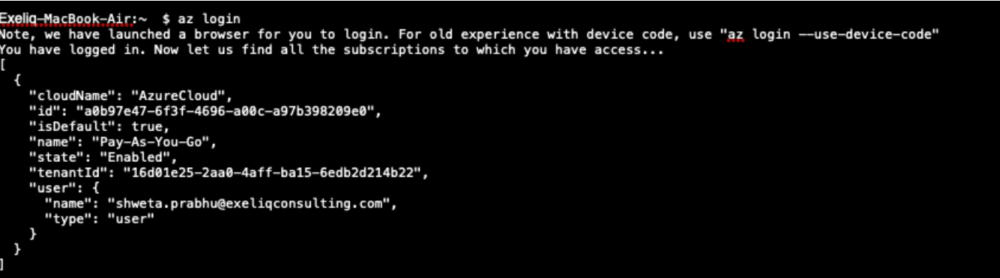
   
Azure container Registry
===========================

Azure Container Registry (ACR) is a private registry for container images. A private container registry lets you securely build and 
deploy your applications and custom code. In order to push images to ACR, you need to deploy an ACR instance and push a container image 
to it. You’ll have to:

- Create an Azure Container Registry (ACR) instance
- Tag a container image for ACR
- push the image to ACR

To create an Azure Container Registry, you first need a resource group. An Azure resource group is a logical container into which Azure
resources are deployed and managed.

Create a resource group with the az group create command as shown below:

.. code-block:: bash

   $ az group create --name ${ResourceGroup} --location eastus

Create an Azure Container Registry instance with the az acr create command and provide your own registry name. The Basic SKU is a 
cost-optimized entry point for development purposes that provides a balance of storage and throughput.

.. code-deploy:: bash

   $ az acr create --resource-group ${ResourceGroup} --name ${acrName} --sku Basic
   
To use the ACR instance, you must first log in. Use the $az acr login command and provide the unique name given to the container registry
in the previous step. The command returns a Login Succeeded message once completed as below.

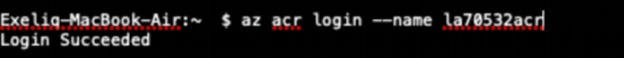

To use the flask container image with ACR, the image needs to be tagged with the login server address of your registry. This tag is used 
for routing when pushing container images to an image registry.

To get the login server address, use the az acr list command and query for the loginServer as follows:

.. code-block:: bash

   $ az acr list --resource-group ${ResourceGroup} --query "[].{acrLoginServer:loginServer}" --output table
   
Push the flask image to Azure Container registry, With your image built and tagged, with ACR instance’s acrLoginServer address. Use 
docker push and provide your own acrLoginServer address for the image name as shown below:

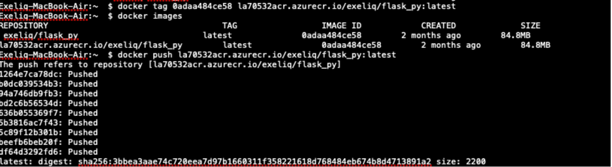
   
You can view the images in the ACR instance with $Az acr repository list as shown below

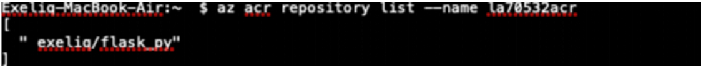
   
Azure Kubernetes cluster setup
===============================

AKS cluster is deployed in Azure by: 
'''''''''''''''''''''''''''''''''''''

- Creating a service principal for resource interactions
- Deploy a Kubernetes AKS cluster
- Install the Kubernetes CLI (kubectl)
- Configure kubectl to connect to AKS cluster

1.Create Service prinicipal for the container service can use to talk to container registry 

.. code-block:: bash

   $ az ad sp create-for-rbac –skip-assignment
   
Make a copy of app ID and password.We need actual ID for our container registry by

.. code-block:: bash

   $ az acr show –name la50532acr –resource-group RGAKS –query “id”

   
Copy the service principal and Assign role of reader of that container registry by

.. code-block:: bash

   $az role assignment create –assignee ${service_principal} --role Reader –scope  ${id}
   
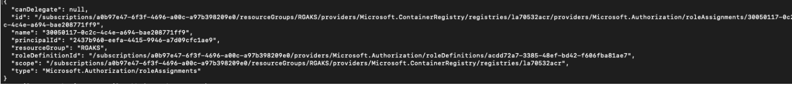

2.Deploy a Kubernetes AKS cluster by 

.. code-block:: bash

   $ Az aks create \
     --resource-group RGAKS \
     --node-count 1 \
     --generate-ssh-keys \
     --service-principal ${service_principal} \
     --client-secret ${Password}
 
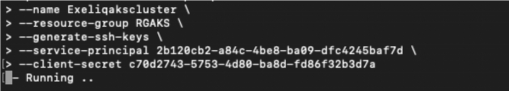
                    
 And the above command creates the AKS cluster.

In the Azure Web Portal, you can see Azure Kubernetes 1.9.11 being creating as a result of Az aks command.

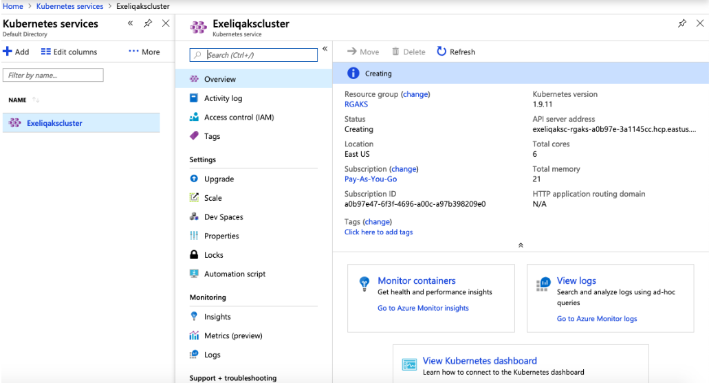
   
Once the cluster is created, the output of the az aks create command would be:

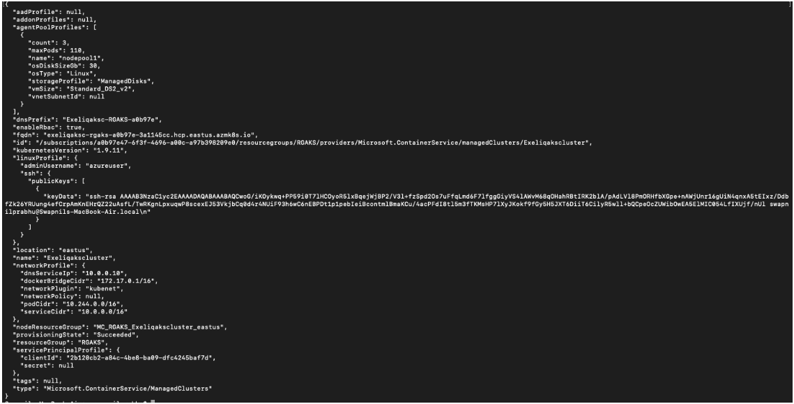
   
3.Install Kubectl(on your local) by:

.. code-block:: bash

   $ Az aks install-cli
   
4.Configure kubectl by:

.. code-block:: bash

   $ Az aks get-credentials –name Exeliqakscluster –resource-group RGAKS

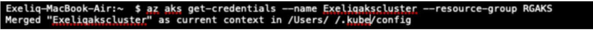

Once the Cluster is up and running, you’d see the nodes that are created for AKS cluster by:

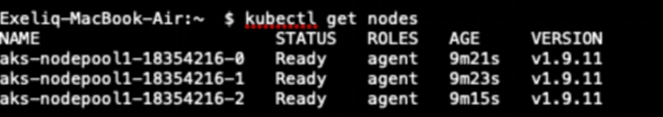

Deployments to AKS
===================

Once the Cluster is up and running and the nodes are in ready state, You can run container image that is pushed to ACR by providing the
image to the kubectl run command as shown below:

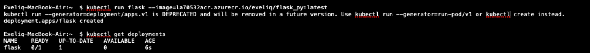

Once the Deployment is created, Ensure that the pods create as a result of the deployment are in running state. 

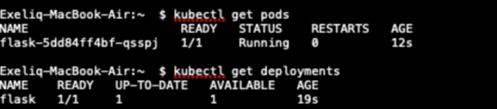

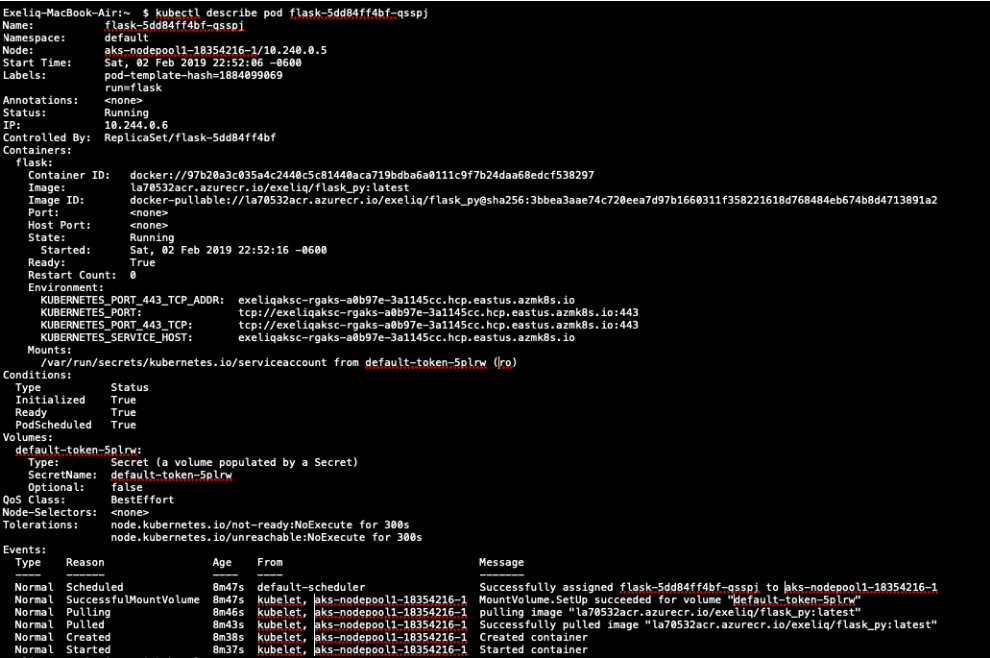
   
Accessing AKS applications:
============================

Inorder to access the deployed applications in AKS, we’ve to expose the deployment as of type NodePort or LoadBalancer. The flask 
deployment can be exposed as below:

.. code-block:: bash

   $ kubectl expose deployment flask –type=LoadBalancer –port=5000

A LoadBalancer is created by azure kubernetes and the IP address is associated as EXTERNAL IP to the service, where the application can 
be accessible with specified port.

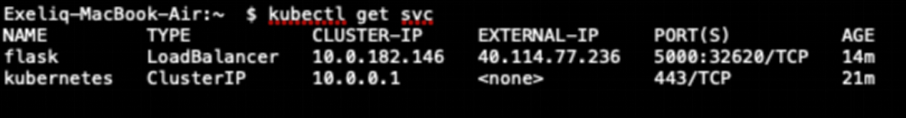
   
You can see the load balancer is created in the Azure Web Portal.

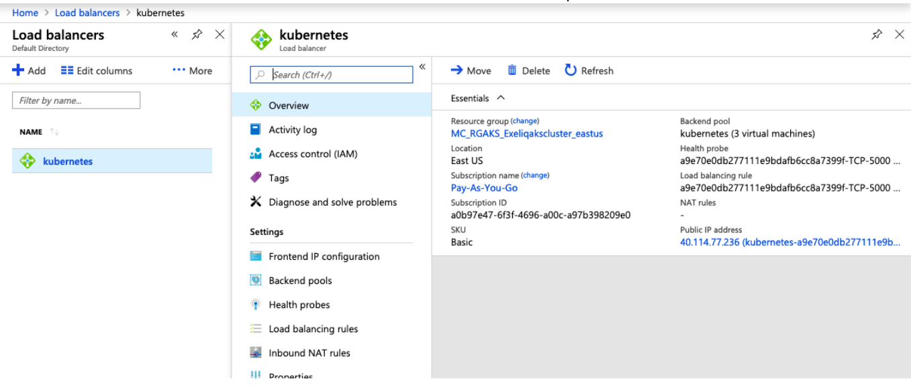
   
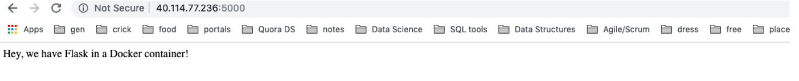
              

EKS
----

Amazon Container Service for Kubernetes(EKS):
==============================================

EKS is managed kubernetes service.  Provisioning of resources is done by AWS thus making undifferentiated heavy lifting for the 
underlying infrastructure that is required for the Kubernetes cluster. Which means AWS EKS  runs the Kubernetes management 
infrastructure across multiple AWS availability zones to avoid single point of failure.Amazon Container Service for Kubernetes(EKS) 
makes it easy to deploy,manage and scale containerized applications using kubernetes on AWS.

- Highly available control plane(3 masters – in different AZ, 3etcd nodes)
- Automated scaling and backup of etcd instances
- Automatically detects and replace unhealthy control plane
- Provides on-demand upgrades and patching
- Networking topology that integrates tightly with VPC

AWS supplied EKS Optimized AMI – docker,kubelet  and AWS IAM Authenticator.
Each pods get an IP address which is part of ENI(Elastic Network Interface. The ENI’s addresses belong to CIDR block of the vpc subnet 
where the worker node of EKS cluster is deployed. They comply with all the policies including security groups and access polices such as
NACL.
When a kubelet on node schedules a pod it communicates with the CNI plugin to allocate an IP address to that pod. At this point a 
secondary IP is allocated to the pod and communicates configuration back to kubelet. 

In order to deploy a Fully functioning kubernetes cluster in AWS, we’ll do the following:

- Create an IAM role - that kubernetes can assume to create resources.
- Create VPC and security groups for the Kubernetes cluster.
- Create EKS cluster 
- Provision worker nodes
- Create ECR repository
- Push container images to ECR
- Deploy container applications

1.Create IAM role: 
using the same IAM role that you intend to manage the cluster from command line. When EKS  cluster is created the IAM entity that 
creates the cluster is added to the kubernetes RBAC authorization table as the administrator. Initially only that IAM user can make 
calls using Kubectl. Attach the follwing policies to the role.

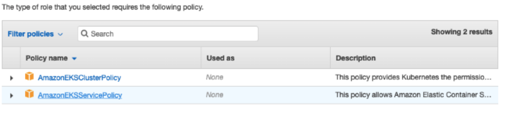

2.Create VPC stack by Cloudformation template: VPC created here would be something like this: 

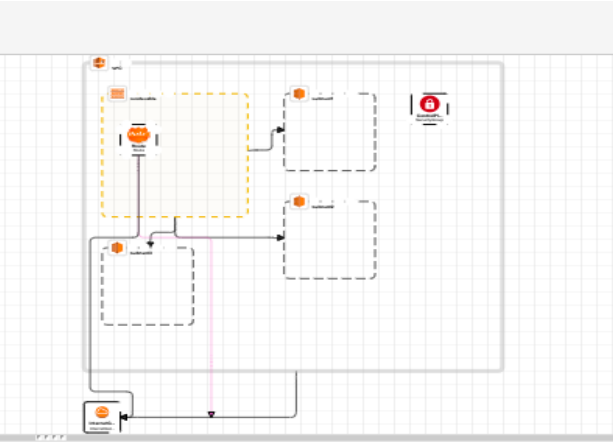
   
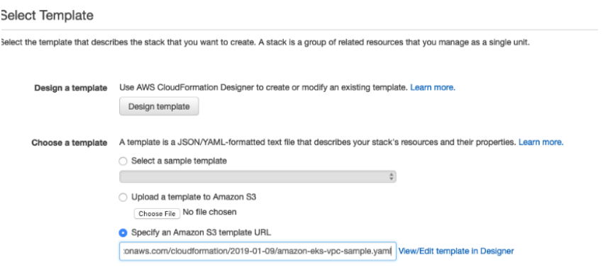

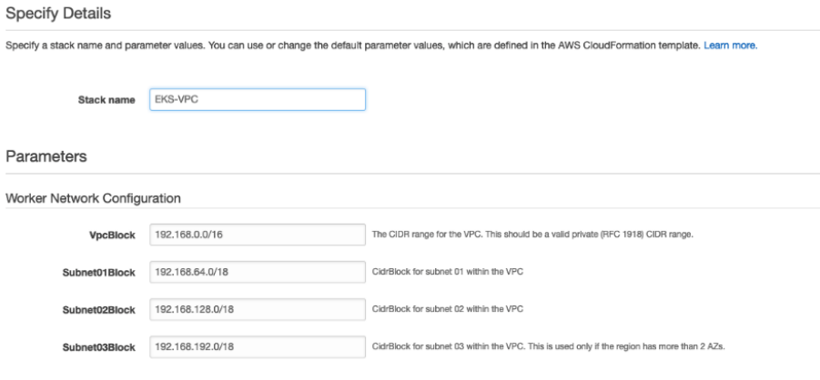
   
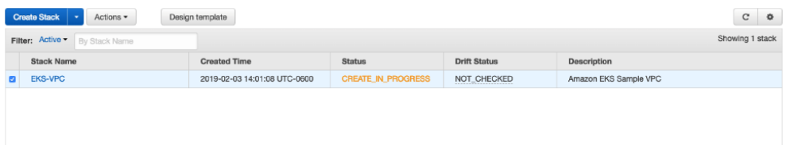

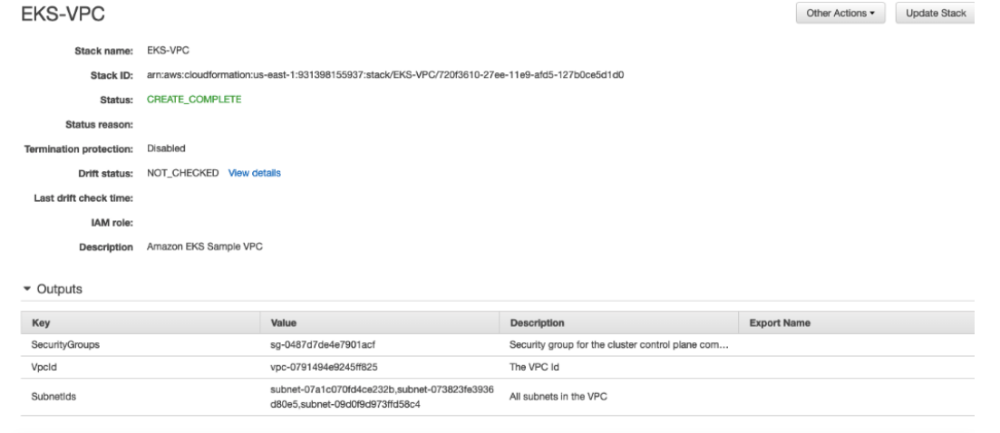

3.Create EKS cluster

In the EKS console,
                           
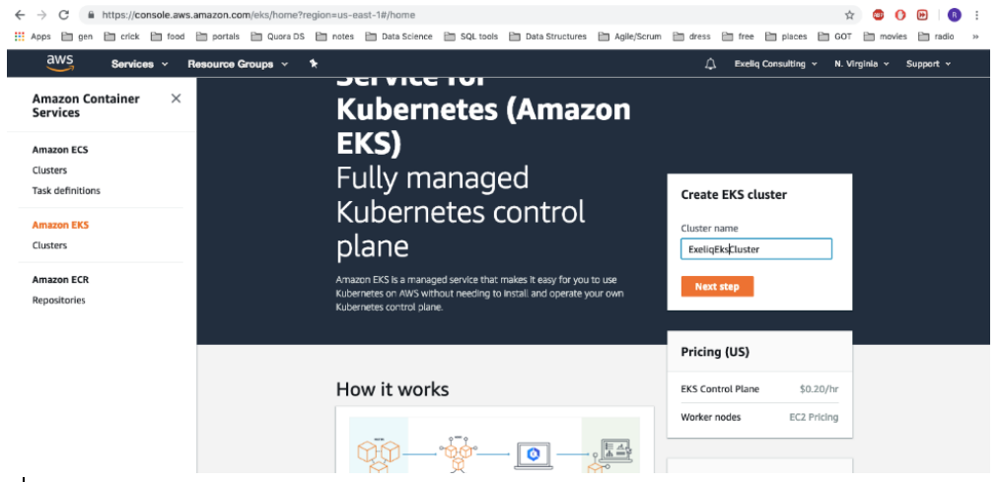
           
Provide the configuration for creating EKS cluster:

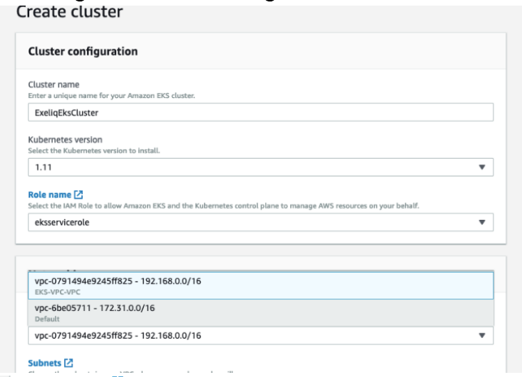
   
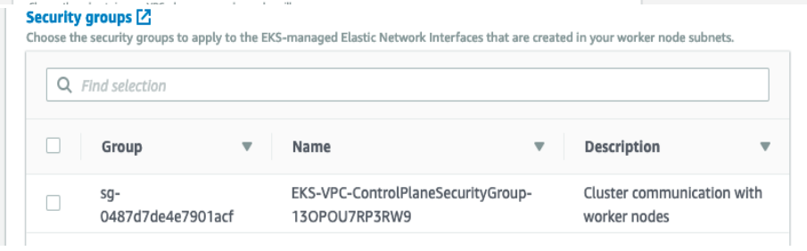
                             
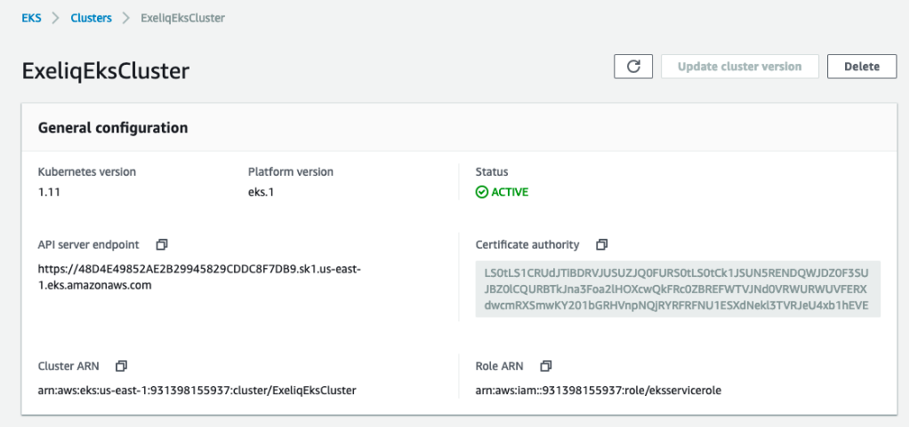

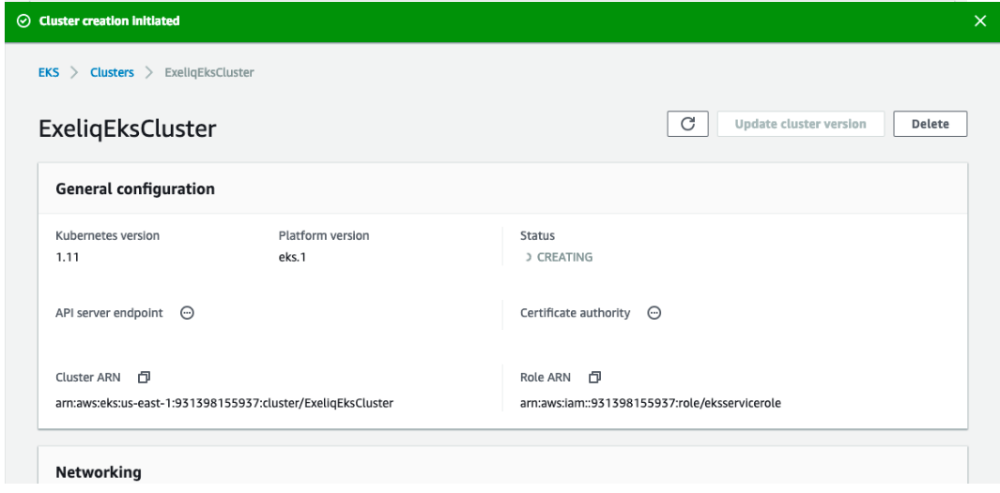

Alternatively you can Create cluster using AWS Cli- 

.. code-block:: bash

   $ aws eks create-cluster --name ${name} --role-arn ${arn --resources-vpc-config subnetIds=${subnet} ,securityGroupIds=${sg-id}

4.Provisioning Worker node:

worker nodes are regular EC2 instances launched from EKS optimized AMI that the instances pre-configured  are ready to join the cluster.

- create cloudformation stack using the S3 url:

:ref: https://amazon-eks.s3-us-west-2.amazonaws.com/cloudformation/2019-01-09/amazon-eks-nodegroup.yaml

Provide the stack name,clustername and select the VPC group that is generated earlier for the control plane security group.
Configure worker node with nodegroup name, autoscaling group,instancetype and image ID- amazon EKS Optimized image id(ami-0c24db5df6badc35a) specific to region., node volume size, Keyname.
For the Worker network configuration, you have to provide VPCID that we created and specify the subnets. Review changes and create stack.
Make a note of the “NodeinstanceRole” value in the output section created once the stack creation is completed. 

In order for the worker nodes to join the EKS cluster we created, we need to apply AWS authenticator configuration map. Download using 
the URL and edit the file by replacing “rolearn” value in the file with `NodeinstanceRole` recorded earlier.

.. code-block:: bash

   apiVersion: v1
   kind: ConfigMap
   metadata:
      name: aws-auth
      namespace: kube-system
   data:
      mapRoles: 
           - rolearn: <ARN of instance role (not instance profile)>
             username: system:node:{{EC2PrivateDNSName}}
            groups:
              - system:bootstrappers
              - system:nodes

Once the configuration is applied as shown, we can see the our nodes being deployed and are in ready state.

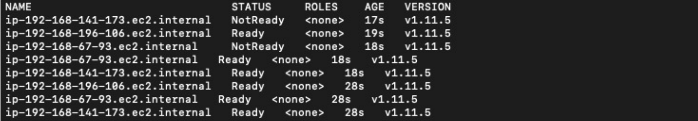

Pushing the container images to ECR:

- To Create an  ECR repository in AWS ECR. 

Login to ECR - $(aws ecr get-login --no-include-email --region us-east-1)

An unique URI would be assigned to the repository. Tag the docker image with the URI and push the image.

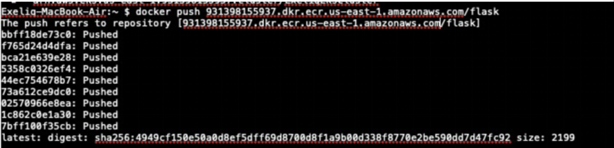
   
Once the image is pushed, you can run the image with the kubectl run command.

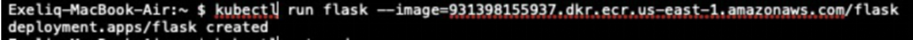
   
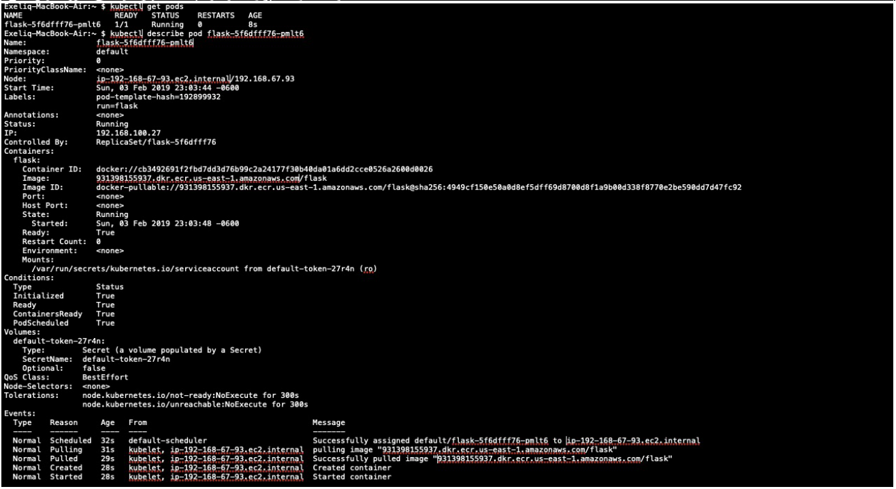

