######################################
Day 10 - Cloud Agnostic Installation 
######################################

KUBEADM
---------

Overview of kubeadm
====================

Kubeadm is a tool built to provide kubeadm init and kubeadm join as best-practice “fast paths” for creating Kubernetes clusters. kubeadm performs the actions necessary to get a minimum viable cluster up and running. By design, it cares only about bootstrapping, not about provisioning machines. Likewise, installing various nice-to-have addons, like the Kubernetes Dashboard, monitoring solutions, and cloud-specific addons, is not in scope.

Pre-requistes:
==============

- One or more machines running a deb/rpm-compatible OS, for example Ubuntu or CentOS
- 2 GB or more of RAM per machine. Any less leaves little room for your apps.
- 2 CPUs or more on the master
- Full network connectivity among all machines in the cluster. A public or private network is fine.

Installing kubeadm on your hosts by(ubuntu):
=============================================

.. code-block:: bash

   $ apt-get update && apt-get install -y apt-transport-https curl
   $ curl -s https://packages.cloud.google.com/apt/doc/apt-key.gpg | apt-key 
   $ add -
     cat <<EOF >/etc/apt/sources.list.d/kubernetes.list
     deb https://apt.kubernetes.io/ kubernetes-xenial main
     EOF
   $ apt-get update
   $ apt-get install -y kubelet kubeadm kubectl
   $ apt-mark hold kubelet kubeadm kubectl

Installing kubeadm on your hosts by(Fedora):
=============================================

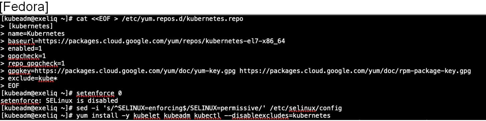

The command to initialize the control plane is

.. code-block:: bash

   $ kubeadm init. 
   
You can pass parameters such as api server listening endpoint, pod network cidr and kubernetes version to be installed.
Kubeadm allows you to create a control-plane node in phases.The init command executes the series of phases:

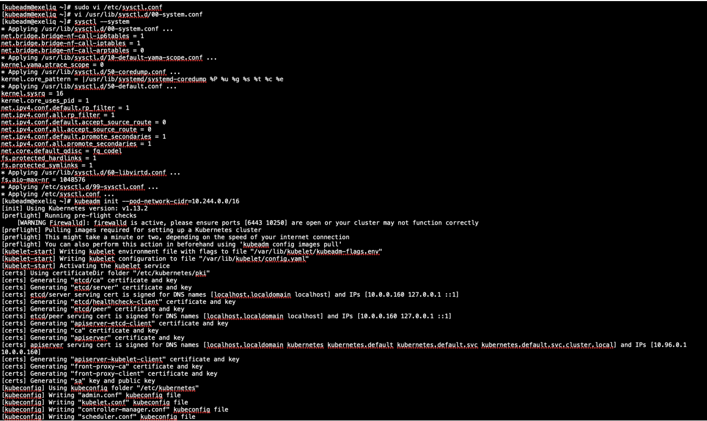

Once installed you can check the version of the kubeadm installed by 

.. code-block:: bash

   $kubeadm version

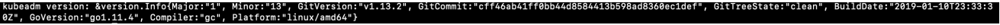

Ensure all the Kubernetes control plane components are in running  status.

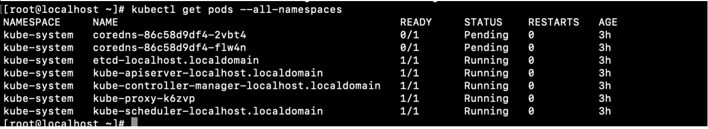

At this point you’ve kubernetes control plane components, but you can able to add worker nodes to this kubeadm cluster by,

kubeadm join:
^^^^^^^^^^^^^^

- Joining your nodes:

The nodes are where your workloads (containers and pods, etc) run. To add new nodes to your cluster do the following for each machine:

SSH to the machine
Become root (e.g. sudo su -)
Run the command that was output by kubeadm init. Example as shown:
 
Run this on any machine you wish to join an existing cluster. kubeadm configures the local kubelet to connect to the API server with the definitive identity assigned to the node.

.. code-block:: bash

   $ kubeadm join --discovery-token abcdef.1234567890abcdef --discovery-token-ca-cert-hash sha256:<hash>

If you don’t have the value of --discovery-token-ca-cert-hash, you can get it by running the following command chain on the master node:

.. code-block:: bash

   $ openssl x509 -pubkey -in /etc/kubernetes/pki/ca.crt | openssl rsa -pubin -outform der 2>/dev/null | \
     openssl dgst -sha256 -hex | sed 's/^.* //'

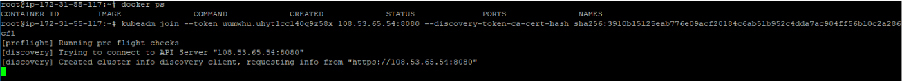

This is token-based discovery of the kubeadm master with CA pinning.

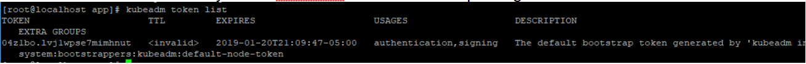

The token outputted by kubeadm is valid for 23h. If expired you can generate another token by 

.. code-block:: bash

   $ kubeadm token create

You can get the existing token list by 

.. code-block:: bash

   $kubectl token list

Once the worker node is registered to the master, application deployments or pods can be deployed the same way we did in minikube. But if we want to consider the master node alone for the deployments as well, then that can be done by removing taints on the master node as shown:

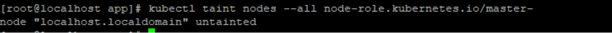

At this point, kubernetes would be abe to schedule the pods on the master node too. But if there is any error that is related to network plugin during the scheduling of pods for example as shown below, you would need to install CNI-plugin for pod/container communication.

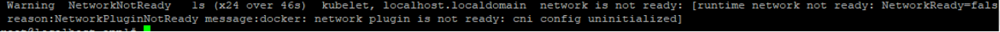
   
You can install CNI-plugin such as Calico or weavenet here after to put forth the pod/container communication, which we’ll showcase in implementation of self-hosted kubernetes cluster.

Install calic CNI plugin by:
^^^^^^^^^^^^^^^^^^^^^^^^^^^^

.. code-block:: bash

   $ kubectl apply -f https://docs.projectcalico.org/v3.3/getting-started/kubernetes/installation/hosted/rbac-kdd.yaml
   $ kubectl apply -f https://docs.projectcalico.org/v3.3/getting-started/kubernetes/installation/hosted/kubernetes-datastore/calico-        networking/1.7/calico.yaml

- Ensure the calico pods are running as expected:

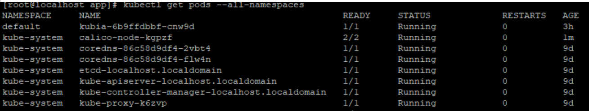

Now you can create a deployment, with the deployment descriptor or application YAML file and run it with kubectl command. Again Ensure the pod is in running state that is created by the deployment. 

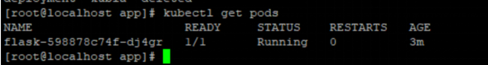

Now you can expose the deployment as of type NodePort so that the service available for the clients.

KOPS
-----

KOPS installation
==================

- Install Kops:

.. code-block:: bash

   $ curl -LO https://github.com/kubernetes/kops/releases/download/$(curl -s            https://api.github.com/repos/kubernetes/kops/releases/latest | grep tag_name | cut -d '"' -f 4)/kops-linux-amd64
   $ chmod +x kops-linux-amd64
   $ sudo mv kops-linux-amd64 /usr/local/bin/kops

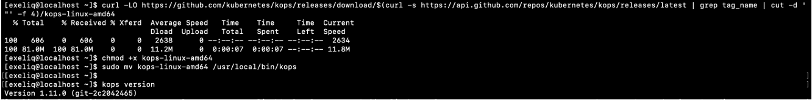

Create an AWS S3 bucket for kops to persist the cluster state:

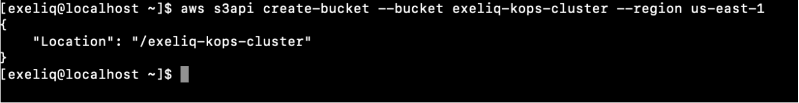
   
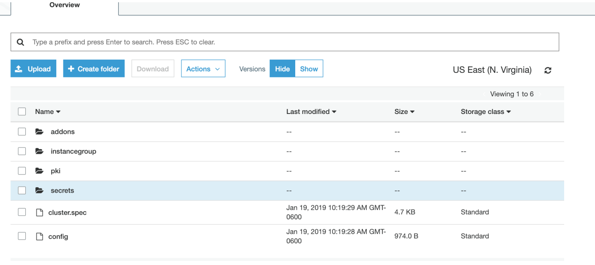

Enable versioning for the above S3 bucket:
 
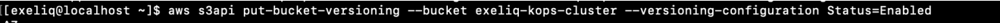

Provide a name for the Kubernetes cluster and set the S3 bucket URL in the following environment variables:

.. code-block:: bash

   $ export KOPS_CLUSTER_NAME=exeliq.k8s.local
   $ export KOPS_STATE_STORE=s3:// exeliq-kops-cluster

Create a Kubernetes cluster definition using kops by providing the required node count, node size, and AWS zones. The node size or rather the EC2 instance type would need to be decided according to the workload that you are planning to run on the Kubernetes cluster:

.. code-block:: bash

   $ sudo kops create cluster --name=exeliq.k8s.local --state s3://exeliq-kops-cluster --zones=us-east-1a --yes

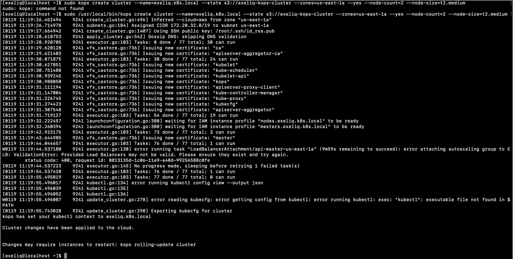

Meanwhile, AWS Ec2 instances will be launched in the specified Regoin – master of type C4.large by default.

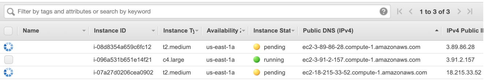

Once the instances are registered with the master, Validate the cluster

.. code-block:: bash

   $ kops validate cluster --name= exeliq.k8s.local

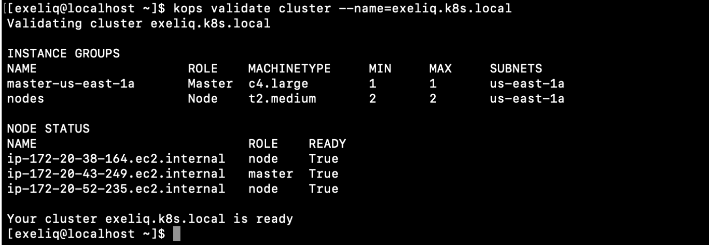
   
Ensure All of the Kubernetes daemons are up and running.

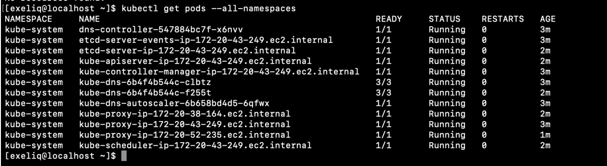

Create deployment/run the Application specifying the image

.. code-block:: bash

   $ kubectl run hello-world --replicas=5 --labels="run=load-balancer-example" --image=gcr.io/google-samples/node-hello:1.0  --port=8080

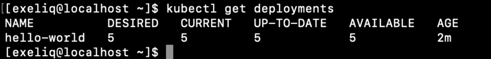
   
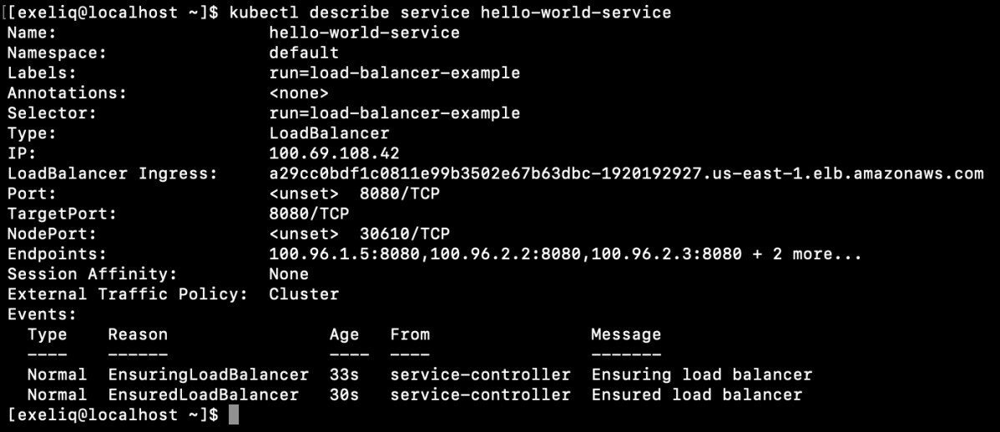

Expose the deployment:

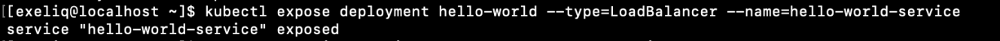

.. code-block:: bash

   $ kubectl expose deployment hello-world --type=LoadBalancer --name=my-service

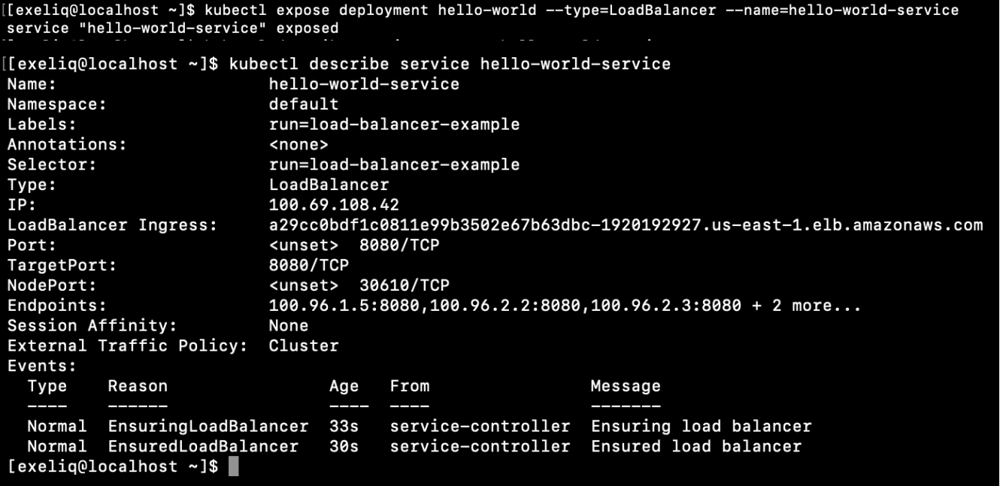

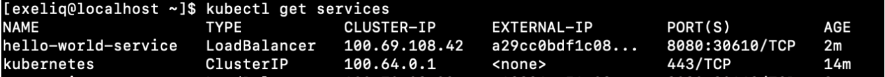
   

   
Access your service that is deployed in kubernetes with the external IP along with port specified within the service in a browser outside of the cluster.

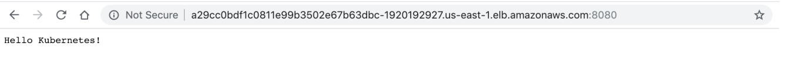
   
Access your service that is deployed in kubernetes with the external IP along with port specified within the service in a browser outside of the cluster.

Deploying our Python Flask application:
========================================

Since we showcased the usage of local registry using minikube we’ll demonstrate this section using docker hub for the same python flask app. 

Sequence of steps to deploy flask application:

1)Build the Docker image the same way as shown in minikube section.

2)Tag the docker image with the username: 

Ex: $docker tag de52b31bd609 exeliq/flaskapp:latest

3)Once the image is tagged with your username, push the image to the DockerHub registry(it can be public/private), To push the image to docker hub, “create secret”.

.. code-block:: bash

   $ kubectl create secret docker-registry dockcred --docker-server=docker.io --docker-username=${username} --docker-                        password=${password} -—docker-email=${email}
   
4)You can run the docker image in two ways. The first is to run the image with Kubectl as shown below. But this way, is constrained to allow only few parameters to be specified to the kubectl command. 

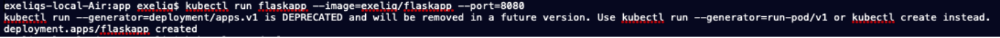

5)CREATING A SERVICE THROUGH A YAML DESCRIPTOR

While the declarative approach of creating YAML script for the deployment would allow to declare more specifications such as replicasets, port etc., . Now create a yaml file for the kubernetes deployment to be created. The deployment yaml file consists of specifications in a declarative way that pulls the image from DockerHub, creates deployment and deploy the application. The Yaml looks something like this:

.. code-block:: bash

   #Flaskapp.yaml
   apiVersion: apps/v1beta1 
   kind: Deployment
   metadata:
     name: flask
   spec:
     replicas: 1
     template:
       metadata:
          labels:
            app: flask
     spec:
       containers:
        - name: flask
             image: exeliq/flask_py:latest
          ports:
        - containerPort: 5000

6)Now verify that the deployment is successful by viewing the deployment status of the application yaml  created as deployment by kubernetes. 
Initially, 

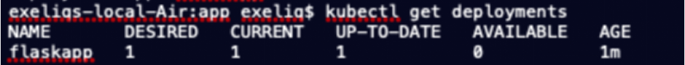

After a while, Make sure the deployment is “Available”,

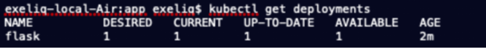
   
7)View the running Pods – the pods should be in a “running” state.

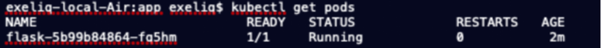

You can also see the node where the pod has been scheduled  by using the $kubectl describe ${pods_name} command, which shows many other details of the pod

8)Edit Deployment(Ex:ReplicaSets):
Replicasets are used to define the number of pods that an application serves and is defined as per the load requirements in the application deployment YAML file. The requests are sent(loadbalanced) to the pods in a round robin fashion by kubernetes engine. In the above application YAML, we’ve declared replica to be 1, hence the deployment is created with 1 desired pod and the $kubectl get pods lists only one pod. But if you specify a different desired number of pods in the pod replica of  the deployment YAML , it would generate that number of pods. 

In order to EDIT and redeploy the existing YAML, we would specify with kubectl command as shown:

.. code-block:: bash

   $ kubectl edit  ${deployment_name} 
              
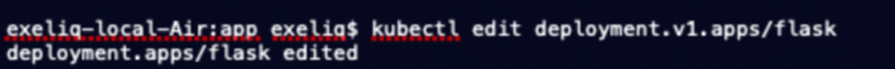
   
The application deployment YAML is configured to set replicas to be 3. 
      
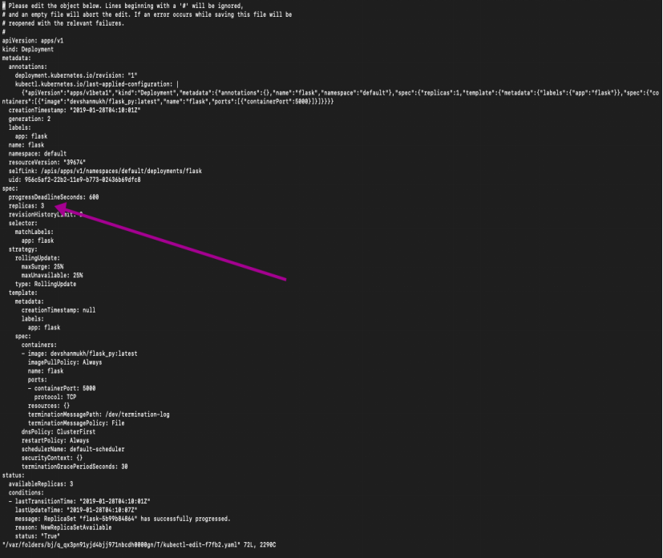

Now $kubectl get pods will list all the 3 pods destined to serve the same application.

.. code-block:: bash

   $ kubectl get pods		
   
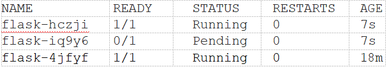

The scaling of pods can also be done on the ReplicationController like this:

.. code-block:: bash

   $ kubectl scale rc kubia --replicas=3

9)Now inorder to apply this configuration:

.. code-block:: bash

   $ kubectl rollout status ${deployment_name}

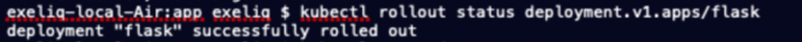

10)Exposing Deployments:

The first method of expose an appliacation  externally is by creating a service and setting its type to NodePort. By creating a NodePort service, you make Kubernetes reserve a port on all its nodes (the same port number is used across all of them) and forward incoming connections to the pods that are part of the service.This is similar to a regular service (their actual type is ClusterIP), but a NodePort service can be accessed not only through the service’s internal cluster IP, but also through any node’s IP and the reserved node port.

11)Now,  Inorder to make the application available out side of the Cluster, we would expose the deployment with :

.. code-block:: bash

    $ kubectl expose deployment flask –type=LoadBalancer –port=8080
    
In here, Note that the deployment is exposed as a service of type “LoadBalancer”, this deployment when exposed as a service of type creates a LoadBlancer that serves the incoming requests and the IP of the loadbalancer is shown as ExternalIP of the “flask” service as shown below:

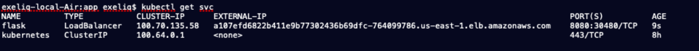

12)Kubernetes clusters running on cloud providers usually support the automatic provision of a load balancer from the cloud infrastructure.You can see the LoadBalancer created in the Underlying Cloud Provider premise(AWS) as soon as the deployment is exposed as a service of type LoadBlancer.

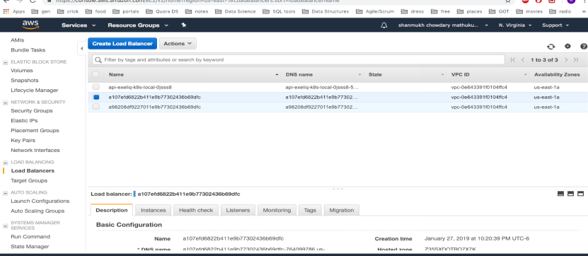

13)Accessing microservice:

Access your service that is deployed in kubernetes KOPS cluster with the external IP(LB IP) along with port specified within the service in a browser outside of the cluster. Further “Service Endpoints” for the service are assigned to be discoverable to other services that are intended to use this service. An Endpoints resource is a list of IP addresses and ports exposing a service. 
                                            
.. code-block:: bash

   $ kubectl get endpoints flask
   
14)To delete KOPS installation of Kubernetes Cluster :

.. code-block:: bash

   $ kops delete cluster --name=$(kube-cluster-name) --yes
