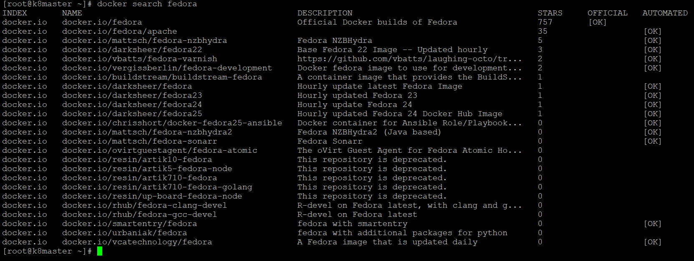
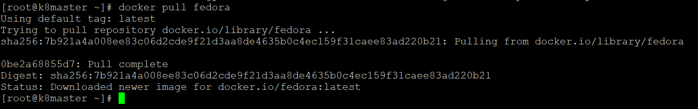
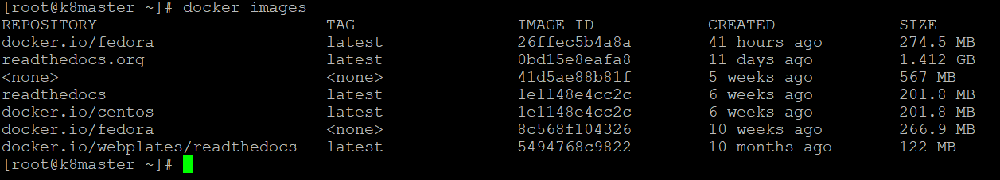
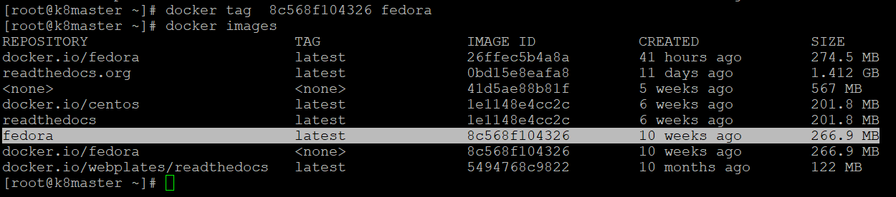
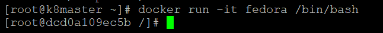
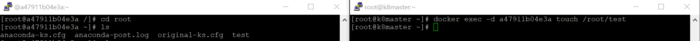
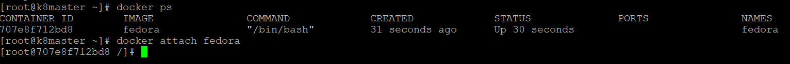
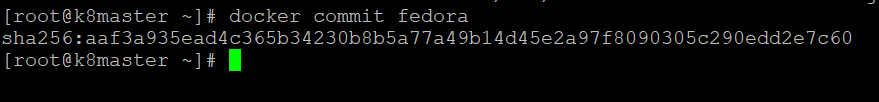

####################
Docker Commands - I
####################

Followings are widely used docker commands
-------------------------------------------

1) docker search
==================

Search the Docker Hub for images
Example:

.. code-block:: bash

    $ docker search fedora

   
   
2) docker pull
===============

The docker pull command serves for downloading Docker images from a registry.

By default, the docker pull command pulls images from Docker Hub, but it is also possible to manually specify the private registry to pull
from.
Before running the docker pull command it needs to search the Docker registry for the image to download.

.. code-block:: bash

    $ docker pull fedora
    

3) docker images
=================

This command is used to display all the images currently installed on the system.

.. code-block:: bash

    $ docker images
    

   
4) docker tag
==============

Create a tag TARGET_IMAGE that refers to SOURCE_IMAGE

.. code-block:: bash

    $ docker tag  8c568f104326 fedora
    

   
5) docker run

The docker run command first creates a writeable container layer over the specified image, and then starts it using the specified command.The docker run command can be used in combination with docker commit to change the command that a container runs.

.. code-block:: bash

    $ docker run -it --name fedora fedora /bin/bash
    

  
6) docker exec 
===============

Docker exec is a commonly used CLI command that allows you to run a command within an existing running container. For example, you might want use docker exec with the -i (interactive) flag to keep stdin open and -t to allocate a terminal.

.. code-block:: bash

    $ docker exec -d fedora touch /root/test
    

   
7) docker attach
=================

Use docker attach to attach your terminal's standard input, output, and error (or any combination of the three) to a running container using the container's ID or name.You can attach to the same contained process multiple times simultaneously, from different sessions on the Docker host.

.. code-block:: bash

    $ docker attach fedora
    

   
8) docker detach
=================

docker run --detach IMAGE. Detached mode, shown by the option --detach or -d , means that a Docker container runs in the background of your terminal. It does not receive input or display output. If you run containers in the background, you find out their details and then reattach your terminal to its input and output.

.. code-block:: bash

    $ docker run --detach fedora
    
9) docker commit
=================

Docker commit command allows users to take a running container and save its current state as an image.

.. code-block:: bash

    $ docker commit fedora
    

