#####################
Docker Commands - II
#####################

Most widely used docker commands
-------------------------------------------

1) docker volume
=================

This command creates a new volume that containers can consume and store data in. If a name is not specified, Docker generates a random name.

.. code-block:: bash
  
   $ docker volume create [OPTIONS] [VOLUME]
   
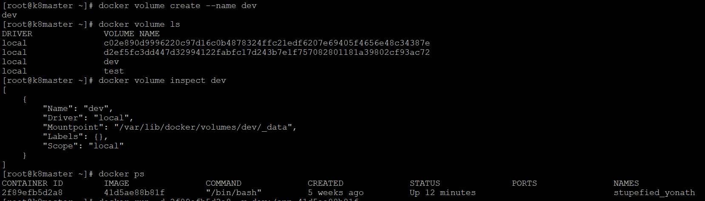
   
2) docker inspect 
==================

This displays the low-level information on Docker object(s) (e.g. container, image, volume,network, node, service, or task) identified by 
name or ID. By default, this will render all results in a JSON array. If the container and image have the same name, this will return 
container JSON for unspecified type. If a format is specified, the given template will be executed for each result.

.. code-block:: bash
  
   $ docker inspect fedora

.. image:: dockerinspect.PNG
   :width: 800px
   :height: 400px
   :alt: alternate text
   
3) docker history
==================

This command will show history of an image.

.. code-block:: bash
  
   $ docker history fedora

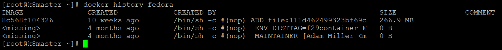
   
4) docker save
================

Save one or more images to a tar archive (streamed to STDOUT by default)

.. code-block:: bash
  
   $ docker save -o fedora.tar
   
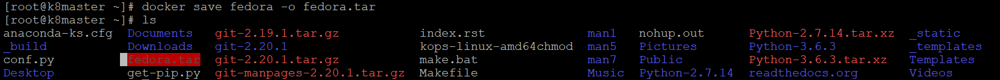
   
5) docker load 
================

This command will load an image from a tar archive or STDIN

.. code-block:: bash
  
   $ docker load --input fedora.tar
   
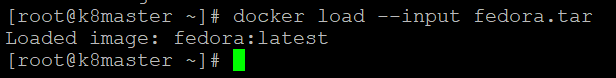
 
 6) docker import
 =================
 
 This commnad will import the contents from a tarball to create a filesystem image
 
 .. code-block:: bash
  
   $ docker import /root/fedora.tar
   
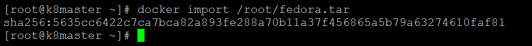
 
7) docker export
=================

This command will export a container's filesystem as a tar archive

 .. code-block:: bash
  
   $ docker export fedora > fedora-image.tar
   
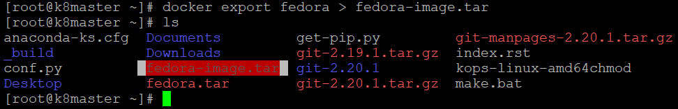
   
8) docker ps 
=============

This command will list the available containers

 .. code-block:: bash
  
   $ docker ps
   
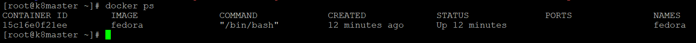
   
9) docker push
===============

This will push an image or a repository to a docker registry.

Log into the Docker Hub from the command line. Use below command to login

.. code-block:: bash
  
   $ docker login --username=yourhubusername --email=youremail@company.com
   $ docker push [Options] NAME[:TAG]
   
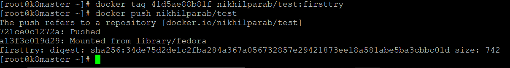
  
10) docker rm
=============
 
This command will delete the respective container

.. code-block:: bash
  
   $ docker rm fedora
   
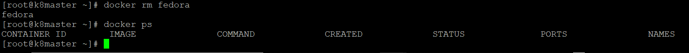
   
11) docker rmi
===============

This command will delete the respective image

.. code-block:: bash
  
   $ docker rmi <image name>
   
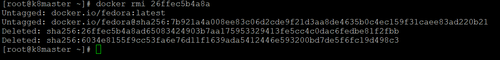
   
12) docker start/stop
======================

This will start/stop one or more stopped/started containers

.. code-block:: bash
  
   $ docker start <container name>
   
   $ docker stop <container name>
      
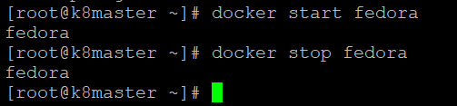

13) docker stats
=================

It will display a live stream of container(s) resource usage statistics

.. code-block:: bash
  
   $ docker stats <container name>
   
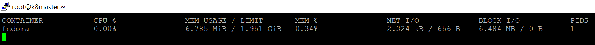
   
14) docker logs
===============

This will fetch the logs of a container

.. code-block:: bash
  
   $ docker logs <container name>
   
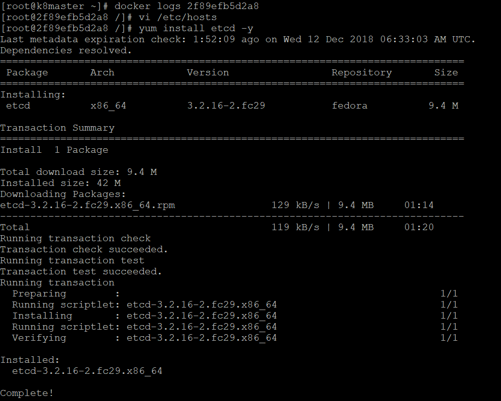
   
15) docker diff
===============

This will inspect changes to files or directories on a container's filesystem

.. code-block:: bash
  
   $ docker logs <container name>
   
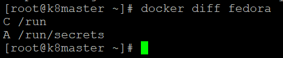
   
16) docker network
===================

This will manage all docker network

.. code-block:: bash
  
   $ docker network ls
   
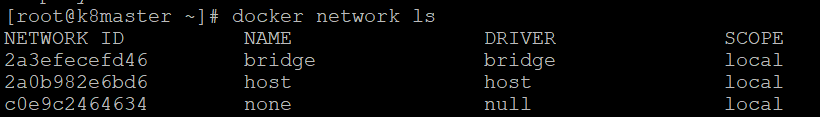
   

 

