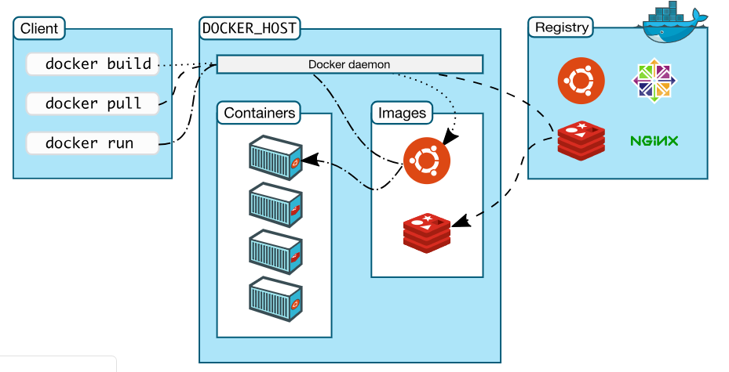

########
Docker
########

1. Introduction to Docker
---------------------------

Docker is an open source software platform to create, deploy and manage virtualized application containers on a common operating system
(OS), with an ecosystem of allied tools. Docker Inc., the company that originally developed Docker, supports a commercial edition and is 
the principal sponsor of the open source tool.

Docker is a tool that packages, provisions and runs containers independent of the OS. Container technology is available through the 
operating system: A container packages the application service or function with all of the libraries, configuration files, dependencies 
and other necessary parts to operate. Each container shares the services of one underlying operating system.

Docker was created to work on the Linux platform, but has extended to offer greater support for non-Linux operating systems, including 
Microsoft Windows and Apple OS X. Versions of Docker for Amazon Web Services (AWS) and Microsoft Azure are available.

2. Docker Architecture
-----------------------

Docker uses a client-server architecture. The Docker client talks to the Docker daemon, which does the heavy lifting of building, running,
and distributing your Docker containers. The Docker client and daemon can run on the same system, or you can connect a Docker client to 
a remote Docker daemon.

3. Docker Components
---------------------

- Docker Images

A Docker image is a file, comprised of multiple layers, used to execute code in a Docker container. An image is essentially built from the instructions for a complete and executable version of an application, which relies on the host OS kernel

- Docker Containers

Container is the execution environment for Docker. Containers are created from images. It is a writable layer of the image. You can package your applications in a container, commit it and make it a golden image to build more containers from it. Two or more containers can be linked together to form tiered application architecture. Containers can be started, stopped, committed and terminated. If you terminate a container without committing it, all the changes made to the container will be lost.

- Docker registries

A Docker registry stores Docker images. Docker Hub is a public registry that anyone can use, and Docker is configured to look for images on Docker Hub by default. You can even run your own private registry. If you use Docker Datacenter (DDC), it includes Docker Trusted Registry (DTR).

When you use the docker pull or docker run commands, the required images are pulled from your configured registry. When you use the docker push command, your image is pushed to your configured registry.

- The Docker daemon

The Docker daemon (dockerd) listens for Docker API requests and manages Docker objects such as images, containers, networks, and volumes. A daemon can also communicate with other daemons to manage Docker services.

- The Docker client

The Docker client (docker) is the primary way that many Docker users interact with Docker. When you use commands such as docker run, the client sends these commands to dockerd, which carries them out. The docker command uses the Docker API. The Docker client can communicate with more than one daemon.

