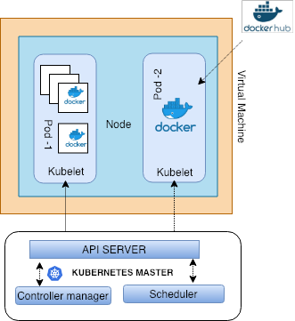
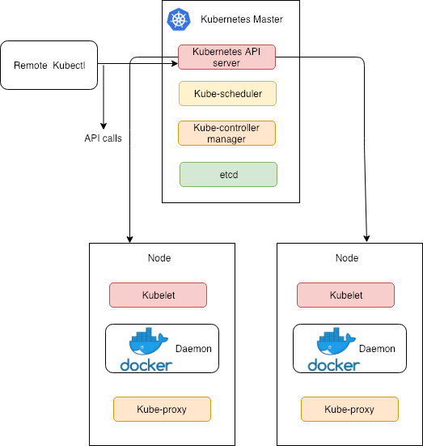
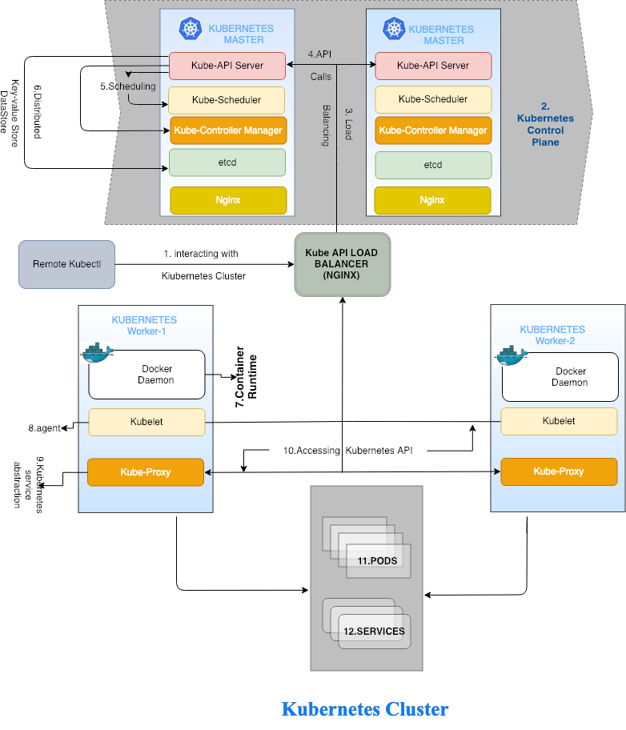

#######################
Intro To Kubernetes
#######################

1. Container Orchestration
---------------------------

1.1 Quick Introduction
=======================

Containers are revolutionizing the way we deliver IT applications. Containers have had enormous impact on the way the organizations
manage IT infrastructure. Containerized applications unlike virtual machines does not need an Operating System to be in place. 
Containerization allowed applications to be packaged with language runtime, libraries and source code and deployed as a whole. 
This isolates the resources that the applications consume.

1.2 What is Container Orchestration? 
======================================

“Orchestration” refers to processes used to manage these containers and automate the management of these containers. 
 
If you imagine a traditional organization’s IT Data center, it consists of physical servers that ranges from 1 to few hundreds and 
thousands of them. Just like if a physical machine is failed or need to be configured in terms of memory , storage and networking  or 
software patching or least a restart is required in some cases ,necessary steps are taken for the server to be function as is. These steps
may be performed manually in the datacenter or remotely. Now you have thousands of our servers that you need to take care of. Though all 
these aspects comes under datacenter management, the same goes to container except the fact that containers are light-weight VMs without
operating system. Imagine if your server resources are virtual, though with respect to virtualization, with container technology You don’t 
have to spin up a new VM and configure for it to run the application. You don’t have to do OS related stuff – no need of CAPEX, OPEX, 
admin, patching, upgrading, driver support, security etc., Containers are essentially a process in operating system of the physical server.
But if there are multiple physical servers that host containers, and if there are tens of hundreds of containers in each and every node, 
you need a system that manages your containers time-to-time.

Simply said - Container Orchestration refers to the automated arrangement, coordination, and management of software containers.

1.3 Need for Container Orchestration
=====================================

Containers when orchestrated play as a team. Orchestration tool deals with message queues, API calls, networking of the containerized applications, not just that, it also takes care of provision resources, limiting resources,  scalability, fault tolerance, deploying the containerized applications with the available pool members. And further, it’ll assist in the state of disaster recovery, where you can potentially can create and set your cluster up and running within few minutes to hours.

An use case is that instead of spinning five containers of same type, necessary for production environment, you could tell an orchestration tool to do it so. 
In other words, Orchestration tool deals with Provisioning, scheduling, redundancy, scalability, fault tolerance, networking of containerized applications.

2. History of Orchestration tools
-----------------------------------

Docker Inc.,  have provided few tools that assist in container orchestration. These are as follows.

- Docker machine – provisions Docker hosts 
- Docker compose – to define and compose multi-container apps, we can specify which images to use,  define network configuration etc. 
- Docker swarm – that assists in scheduling of  Docker containers on different hosts
- Docker Tutem – provides a UI and lets control everything what has to do with containers.

**Kubernetes** – an open source container orchestration tool donated to CNCF(Cloud Native Computing Foundation) by google – “the idea came from BORG, google’s internal container management system”. Kubernetes is a means of running and scheduling container applications on a cluster. Kubernetes, not only can manage docker containers but also rkt(rocket) too. It is best suited for automating deployments, scaling, and operations of application containers across clusters of hosts, providing container-centric infrastructure.

Others include - Mesosphere(DC/OS) – Abstract data center resources into a single pool.

- CoreOS fleet
- Openstack magnum, etcd etc.

3. Kubernetes architecture
---------------------------

3.1 Minikube
=============

While Kubernetes is meant for a distributed cluster of nodes, minikube lets you create a mini local kubernetes cluster in your machine(spinning up local kubernetes cluster),. It is considered as developers sandbox, With minikube you’ll have fully functioning kubernetes cluster within your machine. This is essentially a single node architecture based on virtual machine. The Kubernetes master runs on the physical machine and is used to send commands to the node via the kubectl(a cli tool that helps interact with the cluster) interface. The minikube architecture establishes a new virtual machine in which the Node and Pods required to host your container environment are created. Pods are scheduled on nodes through kube-API calls. Pods provide the staging area for containers and report on their current state (e.g. pending, running) for the course of their life-cycle. An external interface is available via a proxy service allowing each pod to interact with other elements via an exposed IP and port number. 

Once the minikube  is launched , you should see that a virtual machine will be active on your physical machine. When you use minikube (i.e. a one node cluster virtual machine), the architecture looks something like the diagram below. Minikube in absence of load balancer does not provide reliability of distributed kubernetes cluster.

  
3.2 Self – hosted Kubernetes Cluster 
======================================

Self hosted Kuberenetes cluster is literally setting up your kubernetes cluster on-premise/coud without any third party cluster management nor installer such as kops. This Cluster if  for production, have to be secure - TLS communication between nodes, user authorization, network segmentation etc., The cluster can be created with one single master which consists of all the control plane components such as Kuberenetes API server, Kuberenetes controller manager, Kuberenetes scheduler and Etcd data store. But for the purpose of high availability, it  is ideal to have three nodes in the control plane known as controller nodes in a production ready environment. The control plane components will need to be installed on each controller node. Each of the master node consists of all the kubernetes components  along with a http load balancer (ex:nginx) that is to serve the health endpoint of the control plane nodes(masters) over http.
The worker nodes are the work horses that do the  actual hosting of pods which consists containers. These worker nodes has services such as container runtime, kubelet client to run application containers and be managed from the control plane components.

You can interact with the kubernetes cluster (when configured with kube-config) remotely with kubectl just like minikube. In this scenario, the kubernetes api calls are received by the Kube-API Load balancer server and are load balanced  between the master nodes in the control plane. 

- Master node: 

Runs multiple controllers that are responsible for the health of the cluster, replication, scheduling, endpoints (linking Services and Pods), Kubernetes API, interacting with the underlying cloud providers etc. Generally it makes sure everything is running as it should be and looks after worker nodes.

- Worker node (minion): 

Runs the Kubernetes agent that is responsible for running Pod containers via Docker or rkt, requests secrets or configurations, mounts required Pod volumes, does health checks and reports the status of Pods and the node to the rest of the system.

  
The following diagram illustrated two master – two node kubernetes cluster architecture. We  interact and manage kubernets cluster with kubectl – a command line tool used to interact with the kubernetes API and manage kubernetes objects such as pods, services, replica sets, replication controllers etc.,  

  
The above diagram, consists of  kubernetes components which we will explain in the later section.

1) KOPS
^^^^^^^^

Kops(Kubernetes Operations) helps you create, destroy, upgrade and maintain production-grade, highly available, Kubernetes clusters from the command line. AWS (Amazon Web Services) is currently officially supported, with GCE in beta support , and VMware vSphere in alpha, and other platforms planned.

kops is an opinionated provisioning system:

1)Fully automated installation
2)Uses DNS to identify clusters
3)Self-healing: everything runs in Auto-Scaling Groups
4)Multiple OS support (Debian, Ubuntu 16.04 supported, CentOS & RHEL, Amazon Linux and CoreOS) - see the images.md
5)High-Availability support - see the high_availability.md
6)Can directly provision, or generate terraform manifests 

2) Kube-adm
^^^^^^^^^^^^

kubeadm is a kubernetes installer that is part of the Kubernetes distribution as of 1.4.0 which helps you to install and set up a Kubernetes cluster. Kubeadm is tasked with bootstrapping the cluster, it creates all the necessary add-ons for the cluster to function properly, and it supports tokens for adding new Nodes to the cluster. kubeadm creates the necessary certificates for the API, starts the control plane components too for cluster to be up and running.

3) EKS(Elastic Container Service for Kubernetes)
^^^^^^^^^^^^^^^^^^^^^^^^^^^^^^^^^^^^^^^^^^^^^^^^^

Amazon EKS provides a managed kubernetes service , Amazon does the provisioning the cluster, performing upgrades and patching. EKS runs upstream kubernetes in  a certified kubernets conformant so its compatible with existing plugins and tooling. There will be a administering costs regardless of cluster size. EKS is also loosely integrated with other AWS services.  A fact is that 60% of kubernetes deployments are on EKS. EKS provides managed kubernetes control plane – 3 master nodes, etcd persistence layer, automated scaling etc., You are responsible for management of worker nodes –EKS optimized AMI is provided by AWS.  These master nodes are placed in multiple AZs for redundancy and are invisible.

4) AKS[Azure Kubernetes Service]

Microsoft Azure Kubernetes Service simplifies deployments, management and operations of kubernetes – scaling, upgrade, self-healing of master. AKS manages hosted Kubernetes environment thereby eliminating the burden of ongoing operations and maintenance by provisioning, upgrading and scaling resources on demand. AKS abstract complex infrastructure requirements for kubernetes cluster using Azure VMs as worker nodes and by managed Azure Master Node which reduces the operational overhead of managing a kubernetes cluster by offloading much of the responsibility to Azure – takes care of health monitoring. Through AKS, you will be able to acess enterprise grade features of Microsoft Azure.  Unlike EKS, you’ll be charged for the usage of the AZURE VMs that work as Worker nodes within AKS. 

4. Kubernetes Components
--------------------------

The Kubernetes control planes consists of the following components.

- kube-apiserver

Serves the Kubernetes API. This allows users to interact with the cluster. 

- Etcd 

A distributed key value  store that provides a reliable way to store data across a cluster of machines. – make sure data is synchronized across all machines.

- kube-scheduler

Schedules pods on available worker nodes.

- kube-controller-manager

Runs a series of controllers that provide a wide range of functionality.

- cloud-controller-manager

Handles interaction with underlying cloud providers (if adopted). 

- Kubernetes Worker Nodes 

Kubernetes needs to be installed in all of the worker nodes

- Kubelet  

Controls each worker node, provide the APIs that are used by the control plane to manage nodes and pods and interacts with container runtime to manage containers.

- Kube-proxy 

manages iptables rules on the node to provide virtual network access to pods.

- Container runtime(Docker) 

Downloads images and runs containers.

5. Kubernetes concepts
------------------------

1) Pod

The smallest and simplest unit in the Kubernetes object model that you can create or deploy. It represents a running process in the cluster. a group of one or more containers (such as Docker containers), with shared storage/network, and a specification for how to run the containers. Even if the pod has several containers, they will all be reachable in the network through a single IP address.

- All containers for a pod will be run on the same node.
- Any container running within a pod will share the Node’s network with any other containers in the same pod
- Containers within the pod can share files through volumes attached to containers.
- A pod has explicit life cycle and will always  remain on the node which it was started.

2) Namepspaces

3) ReplicaSet

Controller that ensures a specified number of Pod instances (defined in the Deployment) is running at any given time. Provides self-healing capabilities.

4) Replication Controller

5) Deployments

Provides declarative updates for Pods (like the template for the Pods), Desired state means the cluster will work to keep it like you specified, even if a node in your cluster fails. Kubernetes will detect this and compensate by spinning up the objects on the remaining nodes in order to restore the desired state. for example the Docker image(s) to use, environment variables, how many Pod replicas to run, labels, node selectors, volumes etc.

6) Service

An abstraction which defines a logical set of Pods and a policy by which to access them (determined by a label selector). Generally it’s used to expose Pods to other services within the cluster (using targetPort) or externally (using NodePort or LoadBalancer objects).

7) Labels

8) Volumes

9) HPA

10) DaemonSet

It’s like a Deployment but instead runs a copy of a Pod (or multiple) on all (or some) nodes. Useful for things like log collection daemons (sumologic, fluentd), node monitoring daemons (datadog) and cluster storage daemons (glusterd).
