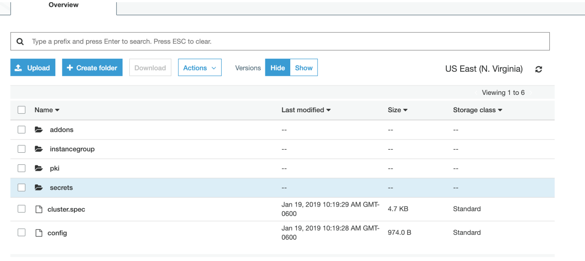
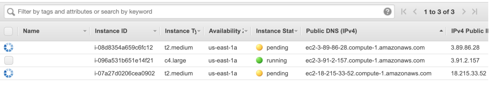
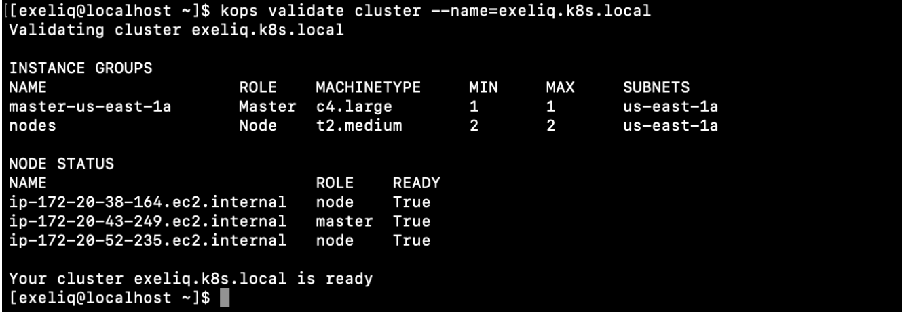
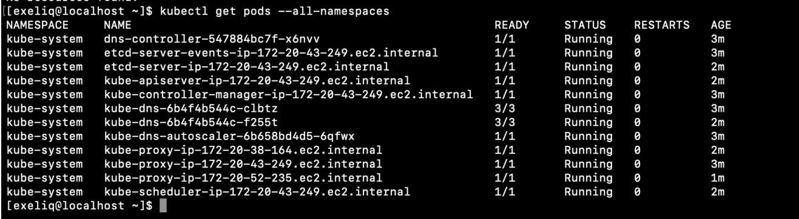
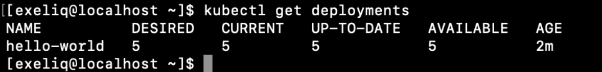
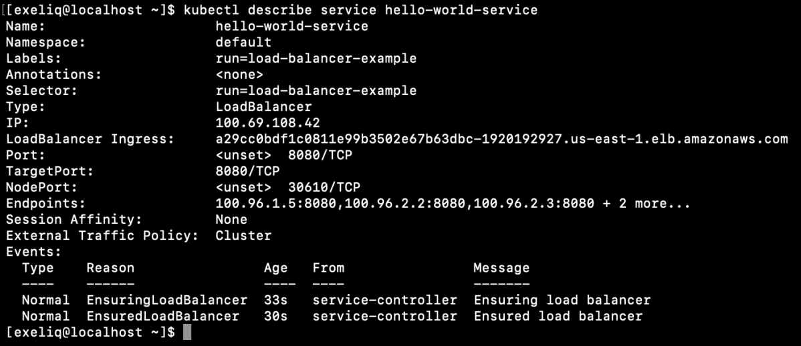
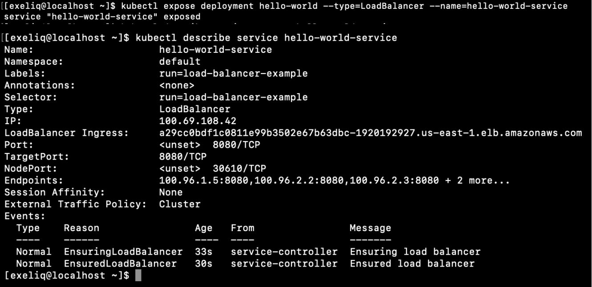
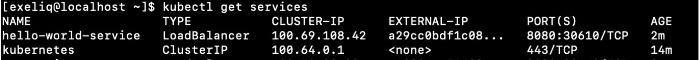

#######################
KOPS Installation
#######################

Cloud Agnostic Kubernetes Cluster setup:
----------------------------------------

KOPS installation
==================

- Install Kops:

.. code-block:: bash

   $ curl -LO https://github.com/kubernetes/kops/releases/download/$(curl -s https://api.github.com/repos/kubernetes/kops/releases/latest | grep tag_name | cut -d '"' -f 4)/kops-linux-amd64
   $ chmod +x kops-linux-amd64
   $ sudo mv kops-linux-amd64 /usr/local/bin/kops

.. image:: kubeadm/kops1.PNG
   :width: 800px
   :height: 150px
   :alt: alternate text

Create an AWS S3 bucket for kops to persist the cluster state:

.. image:: kubeadm/kops2.PNG
   :width: 800px
   :height: 200px
   :alt: alternate text
   

Enable versioning for the above S3 bucket:
 
.. image:: kubeadm/kops4.PNG
   :width: 800px
   :height: 50px
   :alt: alternate text

Provide a name for the Kubernetes cluster and set the S3 bucket URL in the following environment variables:

.. code-block:: bash

   $ export KOPS_CLUSTER_NAME=exeliq.k8s.local
   $ export KOPS_STATE_STORE=s3:// exeliq-kops-cluster

Create a Kubernetes cluster definition using kops by providing the required node count, node size, and AWS zones. The node size or rather the EC2 instance type would need to be decided according to the workload that you are planning to run on the Kubernetes cluster:

.. code-block:: bash

   $ sudo kops create cluster --name=exeliq.k8s.local --state s3://exeliq-kops-cluster --zones=us-east-1a --yes

.. image:: kubeadm/kops5.PNG
   :width: 800px
   :height: 500px
   :alt: alternate text

Meanwhile, AWS Ec2 instances will be launched in the specified Regoin – master of type C4.large by default.

Once the instances are registered with the master, Validate the cluster

.. code-block:: bash

   $ kops validate cluster --name= exeliq.k8s.local

   
Ensure All of the Kubernetes daemons are up and running.

Create deployment/run the Application specifying the image

.. code-block:: bash

   $ kubectl run hello-world --replicas=5 --labels="run=load-balancer-example" --image=gcr.io/google-samples/node-hello:1.0  --port=8080

   

Expose the deployment:

.. image:: kubeadm/kops11.PNG
   :width: 800px
   :height: 500px
   :alt: alternate text

.. code-block:: bash

   $ kubectl expose deployment hello-world --type=LoadBalancer --name=my-service

   
 Access your service that is deployed in kubernetes with the external IP along with port specified within the service in a browser outside of the cluster.

.. image:: kubeadm/kops14.PNG
   :width: 800px
   :height: 50px
   :alt: alternate text

To delete KOPS installation of Kubernetes Cluster :

.. code-block:: bash

   $ kops delete cluster --name=$(kube-cluster-name) --yes
