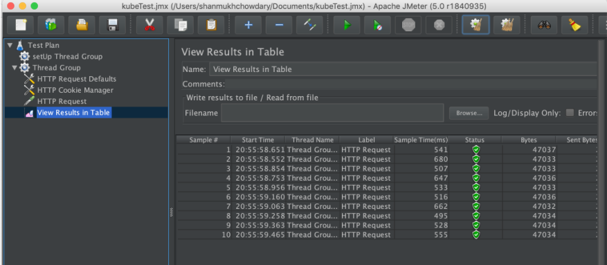

##########################
Kubernetes Cluster Setup
##########################

    
Develeper/local Kubernetes
---------------------------
 
1) Minikube installation
=========================

Container orchestration tools like Kubernetes manage how multiple containers are created, upgraded, and made highly available. Orchestration also controls how containers are connected to build sophisticated applications from multiple, microservice containers. In order to deploy applications in Kubernetes, the application needs to be packaged into one or more container images, push those images to an image registry. The following section demonstrate launching of a Kubernetes cluster in minikube style and shows running an application within a container.

This document presents the use case of setting a Kubernetes cluster using minikube and assumes required infrastructure is in place and you’ll be able to implement the concepts provided through this documentation.

- Required Software
     
    a) docker (1.6.0 or above)

    b) python 2.7 or above

    c) Linux VM - (We used ubuntu 14.04 64 bit)

Minikube is a single binary that needs to be downloaded and put onto your path. It’s available for OSX, Linux, and Windows. 

Start the minikube cluster by executing the command

.. code-block:: bash

   $ minikube start

Kubernetes v1.10.0 is being launched by minikube.  Check whether the Kubernetes daemons such as controller, etcd are running as shown 
below once the cluster is up and running.

you can check the cluster Info as well once the Kubernetes cluster is up and running as shown

a) Establishing architecture
^^^^^^^^^^^^^^^^^^^^^^^^^^^^^

Docker is a platform for packaging, distributing, and running applications. The Building Blocks of Docker are Images, Registries and 
containers . With minikube comes in-built docker daemon, we will dockerize our applications and let minikube run/manage our applications.

In order to Push the docker images, you need to have  registry in place. The following sections demonstrate usage of both local registry
and DockerHub registry.

Once minikube is up and running, using minikube's built-in docker daemon, you can create a registry accessible to minikube by running 
the following commands within minikube

.. code-block:: bash

   $ eval $(minikube docker-env)
   $ docker run -d -p 5000:5000 --restart=always --name dockreg registry:2

   
docker ps command will show you  the registry in running as a container. 

The registry is now ready to use. Kubernetes will pull images from here once the image is pushed. 

b) Developing a microservice
^^^^^^^^^^^^^^^^^^^^^^^^^^^^^

To demonstrate how we package our Microservice application into a docker container, a Microservice based python flask application is 
considered. The following application is first packed into an image and when hosted will serve on port 5000 on the container.  

.. code-block:: python

   #app.py
   from os import environ
   from flask import Flask
   from flask import render_template

   app = Flask(__name__)

   @app.route('/')
   def index():
      return 'Hey, we have Flask in a Docker container! This is app.py'

   if __name__ == '__main__':
      # Bind to PORT if defined, otherwise default to 5000.
      port = int(environ.get('PORT', 5000))
      app.run(host='0.0.0.0', port=port)

To package your app into an image, you first need to create a file called Dockerfile(no extension), which will contain a list of 
instructions that Docker will perform when building the image. The following DockerFile could be used to define a Docker image for the
microservice that’s using python flask framework(app.py). The Dockerfile needs to be in the root of your Flask application and should
contain the commands shown in the following listing. 

.. code-block:: Dockerfile

   FROM python:3.6-alpine
   WORKDIR /app
   COPY requirements.txt /app/requirements.txt
   RUN pip install -r requirements.txt
   COPY . /app
   ENV FLASK_ENV=development
   EXPOSE 5000
   CMD [ "python", "app.py" ]

Following command pushes our flaskapp to local registry.

.. code-block:: bash

   $ docker push localhost:5000/flaskapp:latest
   

Now incase you want to push images to DockerHub Registry, A Kubernetes cluster uses the Secret of docker-registry type to authenticate 
with the registry to pull a private image. you’ll have to create Kubernetes secret as below

.. code-block:: bash

   $ kubectl create secret docker-registry dockcred --docker-server=<your-registry-server> --docker-username=<your-name> --docker-password=<your-pword> --docker-email=<your-email>

c) Deploying a microservice
^^^^^^^^^^^^^^^^^^^^^^^^^^^^

Because this may be your first time, you’ll use the simplest possible way of running an app on Kubernetes. Usually, you’d prepare a
JSON or YAML manifest, containing a description of all the components you want to deploy, but because we haven’t talked about the types
of components you can create in Kubernetes yet, you’ll use a simple one-line command to get something running.

- build your first flask “app.py” image 

Push the image to the Registry service. While choosing the Registry, you can use your local Registry(within minikube) or DockerHub 
registry.

Once the image is pushed, it’ll be used When Kubernetes runs docker pull inside minikube to launch or deploy pods to run the application
that is built within this image in Kubernetes cluster. 

The simplest way to deploy your app is to use the kubectl run command, which will create all the necessary components without having to 
deal with JSON or YAML. This way, we don’t need to dive into the structure of each object yet. During the build process, Docker will 
first pull the base image (node:7) from the image repository (Docker Hub/localhost), unless the image has already been pulled and is 
stored on your machine.

**Create  deployment** : Deployment is a Kubernetes Object that allows one to describe the desired state of a POD such as replicas,
cpu utilization, Memeory etc.

- To create a deployment :

Pods are groups of containers and volumes co-located on the same host. Containers in the same Pod share the same network namespace and 
can communicate with each other using `localhost`. Pods are considered to be ephemeral, rather than durable entities, and are the basic 
scheduling unit.

.. code-block:: bash

   $ kubectl run flaskapp --image=localhost:5000/flaskapp --port=8080

The --image=localhost:5000/flaskapp part obviously specifies the container image you want to run, and the --port=8080 option tells 
Kubernetes that your app is listening on port 8080.

   

d) Exposing a microservice
^^^^^^^^^^^^^^^^^^^^^^^^^^^

As an example, consider an image-processing backend which is running with 3 replicas. Those replicas are fungible - frontends do not 
care which backend they use. While the actual Pods that compose the backend set may change, the frontend clients should not need to be 
aware of that or keep track of the list of backends themselves.

To create the service, you’ll tell Kubernetes to expose the  deployment as shown below: We expose our flaskapp.

You can view the services by executing kubectl get services command.

You can now send requests to your pod through the service’s external IP and port. When using Minikube, you can get the IP and port 
through which you can access the service by running 

.. code-block:: bash

  $ minikube service flaskapp
  
  
e) Accessing microservice internally and externally
^^^^^^^^^^^^^^^^^^^^^^^^^^^^^^^^^^^^^^^^^^^^^^^^^^^^

You have several options for connecting to nodes, pods and services from outside the cluster:

- Access services through public IPs.
- Use a service with type NodePort or LoadBalancer(not in minikube) to make the service reachable outside the cluster. 
- Depending on your cluster environment, this may just expose the service to your corporate network, or it may expose it to the internet. 
- Place pods behind services. To access one specific pod from a set of replicas, such as for debugging, place a unique label on the pod 
and create a new service which selects this label.

f) Establishing High availability
^^^^^^^^^^^^^^^^^^^^^^^^^^^^^^^^^

The Horizontal Pod Autoscaler automatically scales the number of pods in a replication controller, deployment or replica set based on observed CPU utilization (or, with custom metrics support, on some other application-provided metrics). Note that Horizontal Pod Autoscaling does not apply to objects that can’t be scaled, for example, DaemonSets.
Your Kubectl version should be >1.4 for reviewing hpa.

Enable metrics-service addon - 

   
2) Performance testing on kubernetes cluster
=============================================

a) LOAD TESTING IN JMETER:
^^^^^^^^^^^^^^^^^^^^^^^^^^^

1.Make sure your application is up and running in kubernetes Pod and is being provided as a service by Kubernetes. As your Pod is being 
running define horizontal pod autoscaling for your deployment.

.. code-block:: bash

  $ kubectl autoscale deployment flaskapp --cpu-percent=50 --min=1 --max=3 

b) Setting up test plan in Jmeter
^^^^^^^^^^^^^^^^^^^^^^^^^^^^^^^^^

2.Define Test Plan — 

ThreadGroup - No.of Threads, Ramp-up period(in sec),loop count

3.Populate the HTTP Request defaults with name/ip , and Port of the target server 

4.Execute the Test plan. Once the Load Test started, you’d be able to view the results in “view results in table”.

Meanwhile in Kubernetes check  the CPU Resource utilization, and no.of pods running as per the LOAD.

.. code-block:: bash

   $ Kubectl get hpa

3) TESTING USING CLI
=====================

5.Once the above(GUI) Load test has been done, save the test conf. and will be saved as .jmx file so that you can reuse(replay) the test 
again using CLI.

6.Execute the below command (within bin folder of jmeter)

.. code-block:: bash

   $ ./jmeter -n -t /Users/shanmukhchowdary/Documents/kubeTest.jmx -l log.jtl  -H www.kshounish.com -P 8080
   
- -n : This specifies JMeter is to run in non-gui mode
- -t : name of JMX file that contains the Test Plan.
- -l : name of JTL file to log sample results to.
- -H : proxy server hostname or ip address
- -P : proxy server port

7.   The above command runs the Parameterized Jmeter script, you defined in GUI  and Stores the Load test results in log.jtl within the 
current directory.

