###############################
Self-Hosted Kubernetes Cluster
###############################

Self-Hosted Kubernetes cluster can be created provisioned with on-premise physical/virtual servers. The following section demonstrates creating kubernetes cluster and deploying applications in to the kubernetes cluster.

:ref: https://github.com/kelseyhightower/kubernetes-the-hard-way
      
      https://kubernetes.io/docs/setup/scratch/

Kubernetes Architecture:
------------------------

Provisioning Servers:
^^^^^^^^^^^^^^^^^^^^^^

For this Setup, 
we will need a total of five (cloud) servers:
- 2 Kubernetes controllers 
- 2 Kubernetes worker nodes
- 1 Kubernetes API load balancer 

The operating system used is Ubuntu 16.

Prerequistes: 
^^^^^^^^^^^^^

Ensure inbound Security rules are configured for the instances:

- 6784
- 80
- 6443    -- for Loadbalancer 
- 22
- 10250
- 2379
- 2380 

we’ll need two client tools: cfssl and kubectl.

Certificates:
-------------

Certificates are used to confirm (authenticate) identity. They are used to prove that you are who you say you are.

We’ll generate a set of certificates for the control plane and worker nodes as following. Running the following  commands in a directory so that the cert files generated will be in the same directory. 

The following commands does the following:

- Genereates Certificate Authority
- Create a CA certificate signing request
- Generate a CA certificate and private key

.. code-block:: bash
 
   {
     cat > ca-config.json << EOF
   {
        "signing": {
          "default": {
            "expiry": "8760h"
             },
        "profiles": {
          "kubernetes": {
           "usages": ["signing", "key encipherment", "server auth", "client auth"],
            "expiry": "8760h"
                  }
                }
              }
            }
   EOF
   cat > ca-csr.json << EOF
     {
      "CN": "Kubernetes",
       "key": {
          "algo": "rsa",
          "size": 2048
             },
      "names": [
          {
            "C": "US",
            "L": "Portland",
            "O": "Kubernetes",
            "OU": "CA",
            "ST": "Oregon"
           }
         ]
       }
   EOF
   cfssl gencert -initca ca-csr.json | cfssljson -bare ca
   }

Executing the  above commands will generate  two files : ca.pem & key.pem

Generating client Certificates:
^^^^^^^^^^^^^^^^^^^^^^^^^^^^^^^

Once the CA is provisioned, generate Certificates for kubernetes components. Client Certificates provide client authentication for various users – 

- Admin Client certificate:

.. code-block:: bash

   {
      cat > admin-csr.json << EOF
    {
      "CN": "admin",
      "key": {
      "algo": "rsa",
      "size": 2048
      },
     "names": [
         {
           "C": "US",
           "L": "Portland",
           "O": "system:masters",
           "OU": "Kubernetes The Hard Way",
           "ST": "Oregon"
            }
          ]
         }
   EOF

   cfssl gencert \
      -ca=ca.pem \
      -ca-key=ca-key.pem \
      -config=ca-config.json \
      -profile=kubernetes \
      admin-csr.json | cfssljson -bare admin

   }
   

Executing the  above commands will generate  two files : admin-key.pem & admin.pem

- kube-controller-manager

Controller Manager Client certificate:

.. code-block:: bash

   {
     cat > kube-controller-manager-csr.json << EOF
    {
     "CN": "system:kube-controller-manager",
     "key": {
     "algo": "rsa",
     "size": 2048
    },
     "names": [
      {
        "C": "US",
        "L": "Portland",
        "O": "system:kube-controller-manager",
        "OU": "Kubernetes The Hard Way",
        "ST": "Oregon"
        }
      ]
    }
   EOF

   cfssl gencert \
     -ca=ca.pem \
     -ca-key=ca-key.pem \
     -config=ca-config.json \
     -profile=kubernetes \
      kube-controller-manager-csr.json | cfssljson -bare kube-controller-manager

   }
   
- Kube Proxy Client certificate:

.. code-block:: bash

   {
     cat > kube-proxy-csr.json << EOF
    {
      "CN": "system:kube-proxy",
      "key": {
      "algo": "rsa",
      "size": 2048
      },
      "names": [
      {
        "C": "US",
        "L": "Portland",
        "O": "system:node-proxier",
        "OU": "Kubernetes The Hard Way",
        "ST": "Oregon"
       }
      ]
    }
    EOF

   cfssl gencert \
    -ca=ca.pem \
    -ca-key=ca-key.pem \
    -config=ca-config.json \
    -profile=kubernetes \
     kube-proxy-csr.json | cfssljson -bare kube-proxy

    }

- kube-scheduler 

Kube Scheduler Client Certificate:

.. code-block:: bash

   {
    cat > kube-scheduler-csr.json << EOF
    {
      "CN": "system:kube-scheduler",
      "key": {
      "algo": "rsa",
      "size": 2048
      },
    "names": [
      {
        "C": "US",
        "L": "Portland",
        "O": "system:kube-scheduler",
        "OU": "Kubernetes The Hard Way",
        "ST": "Oregon"
         }
       ]
      }
     EOF

     cfssl gencert \
     -ca=ca.pem \
     -ca-key=ca-key.pem \
     -config=ca-config.json \
     -profile=kubernetes \
      kube-scheduler-csr.json | cfssljson -bare kube-scheduler

     }
     
Executing the  above commands will generate  two files : kube-proxy-key.pem & kube-proxy.pem

- kubelet client:

For the kubelet client(csr) file to be generated for each and every worker node, assign the public hostname and private ip of nodes to (node) variables.

For example:

- WORKER1_HOST= ec2-18-222-115-194.us-east-2.compute.amazonaws.com
- WORKER1_IP= 172.31.0.61

Similarly, assign the remaining nodes ip and hostnames. And Generate the csr file for each and every worker node by replacing the node variables in the following code:

.. code-block:: bash

   {
    cat > ${WORKER0_HOST}-csr.json << EOF
    {
     "CN": "system:node:${WORKER0_HOST}",
     "key": {
     "algo": "rsa",
     "size": 2048
      },
    "names": [
     {
      "C": "US",
      "L": "Portland",
      "O": "system:nodes",
      "OU": "Kubernetes The Hard Way",
      "ST": "Oregon"
      }
     ]
    }
    EOF

    cfssl gencert \
     -ca=ca.pem \
     -ca-key=ca-key.pem \
     -config=ca-config.json \
     -hostname=${WORKER0_IP},${WORKER0_HOST} \
     -profile=kubernetes \
     ${WORKER0_HOST}-csr.json | cfssljson -bare ${WORKER0_HOST}

Kubernetes API server Certificate- TLS certificate for Kubernetes API

Assign the hostnames and ips to  a variable that we’ll use to generate the certificate for Kubernetes API server.
For example:

.. code-block:: bash

   CERT_HOSTNAME=10.32.0.1,<Cnode1 Private IP>,<Cnode1 hostname>,<Cnode2 Private IP>,<Cnode2 hostname>,<API LB Private IP>,<API LB hostname>,127.0.0.1,localhost,kubernetes.default

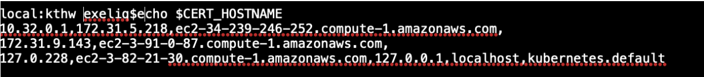

- Generate the Kubernetes API server certificate by:

.. code-block:: bash

   {

     cat > kubernetes-csr.json << EOF
    {
      "CN": "kubernetes",
      "key": {
            "algo": "rsa",
            "size": 2048
             },
      "names": [
         {
           "C": "US",
           "L": "Portland",
           "O": "Kubernetes",
           "OU": "Kubernetes The Hard Way",
           "ST": "Oregon"
           }
          ]
        }
    EOF

    cfssl gencert \
      -ca=ca.pem \
      -ca-key=ca-key.pem \
      -config=ca-config.json \
      -hostname=${CERT_HOSTNAME} \
      -profile=kubernetes \
       kubernetes-csr.json | cfssljson -bare kubernetes

     }

Service Account Key pair – Kubernetes uses a certificate to sign service account tokens. Generate the Service account certs by:

.. code-block:: bash

   {

    cat > service-account-csr.json << EOF
    {
      "CN": "service-accounts",
      "key": {
            "algo": "rsa",
            "size": 2048
             },
      "names": [
        {
          "C": "US",
          "L": "Portland",
          "O": "Kubernetes",
          "OU": "Kubernetes The Hard Way",
          "ST": "Oregon"
         }
       ]
      }
   EOF

   cfssl gencert \
     -ca=ca.pem \
     -ca-key=ca-key.pem \
     -config=ca-config.json \
     -profile=kubernetes \
      service-account-csr.json | cfssljson -bare service-account

   }
 
- Generating KubeConfigs:

Kube config -is a file that stores info about clusters, users, namespaces and authentication mechanism. – store config data.
Create an environment variable to store the address of the Kubernetes API, and set it to the private IP of your load balancer cloud server. 

KUBERNETES_ADDRESS= ec2-52-15-157-244.us-east-2.compute.amazonaws.com

Generate a kubelet kubeconfig for each worker node by:

.. code-block:: certifiate

   for instance in <W1h ostname> <W2 hostname>; do
     kubectl config set-cluster kubernetes-the-hard-way \
       --certificate-authority=ca.pem \
       --embed-certs=true \
       --server=https://${KUBERNETES_ADDRESS}:6443 \
       --kubeconfig=${instance}.kubeconfig

     kubectl config set-credentials system:node:${instance} \
       --client-certificate=${instance}.pem \
       --client-key=${instance}-key.pem \
       --embed-certs=true \
       --kubeconfig=${instance}.kubeconfig

     kubectl config set-context default \
       --cluster=kubernetes-the-hard-way \
       --user=system:node:${instance} \
       --kubeconfig=${instance}.kubeconfig

     kubectl config use-context default --kubeconfig=${instance}.kubeconfig
     done

- Generate a kube-proxy kubeconfig:

.. code-block:: config
 
   {
       kubectl config set-cluster kubernetes-the-hard-way \
         --certificate-authority=ca.pem \
         --embed-certs=true \
         --server=https://${KUBERNETES_ADDRESS}:6443 \
         --kubeconfig=kube-proxy.kubeconfig

      kubectl config set-credentials system:kube-proxy \
         --client-certificate=kube-proxy.pem \
         --client-key=kube-proxy-key.pem \
         --embed-certs=true \
         --kubeconfig=kube-proxy.kubeconfig

      kubectl config set-context default \
         --cluster=kubernetes-the-hard-way \
         --user=system:kube-proxy \
         --kubeconfig=kube-proxy.kubeconfig

      kubectl config use-context default --kubeconfig=kube-proxy.kubeconfig
      }
      
- Generate a kube-controller-manager kubeconfig:

.. code-block:: config

   {
     kubectl config set-cluster kubernetes-the-hard-way \
       --certificate-authority=ca.pem \
       --embed-certs=true \
       --server=https://127.0.0.1:6443 \
       --kubeconfig=kube-controller-manager.kubeconfig

     kubectl config set-credentials system:kube-controller-manager \
       --client-certificate=kube-controller-manager.pem \
       --client-key=kube-controller-manager-key.pem \
       --embed-certs=true \
       --kubeconfig=kube-controller-manager.kubeconfig

     kubectl config set-context default \
       --cluster=kubernetes-the-hard-way \
       --user=system:kube-controller-manager \
       --kubeconfig=kube-controller-manager.kubeconfig

     kubectl config use-context default --kubeconfig=kube-controller-manager.kubeconfig
     }
- Generate a kube-scheduler kubeconfig:

.. code-block:: config

   {
      kubectl config set-cluster kubernetes-the-hard-way \
        --certificate-authority=ca.pem \
        --embed-certs=true \
        --server=https://127.0.0.1:6443 \
        --kubeconfig=kube-scheduler.kubeconfig

      kubectl config set-credentials system:kube-scheduler \
        --client-certificate=kube-scheduler.pem \
        --client-key=kube-scheduler-key.pem \
        --embed-certs=true \
        --kubeconfig=kube-scheduler.kubeconfig

     kubectl config set-context default \
        --cluster=kubernetes-the-hard-way \
        --user=system:kube-scheduler \
        --kubeconfig=kube-scheduler.kubeconfig

     kubectl config use-context default --kubeconfig=kube-scheduler.kubeconfig
     }

- Generate an admin kubeconfig:

.. code-block:: config

   {
      kubectl config set-cluster kubernetes-the-hard-way \
        --certificate-authority=ca.pem \
        --embed-certs=true \
        --server=https://127.0.0.1:6443 \
        --kubeconfig=admin.kubeconfig

      kubectl config set-credentials admin \
        --client-certificate=admin.pem \
        --client-key=admin-key.pem \
        --embed-certs=true \
        --kubeconfig=admin.kubeconfig

      kubectl config set-context default \
        --cluster=kubernetes-the-hard-way \
        --user=admin \
        --kubeconfig=admin.kubeconfig

      kubectl config use-context default --kubeconfig=admin.kubeconfig
      }
      
- Data Encryption: To encrypt sensitive data at rest in Kubernetes

.. code-block:: bash

   ENCRYPTION_KEY=$(head -c 32 /dev/urandom | base64)

   cat > encryption-config.yaml << EOF 
   kind: EncryptionConfig
    apiVersion: v1
   resources:
    - resources:
           - secrets
      providers:
           - aescbc:
                 keys:
                   - name: key1
                     secret: ${ENCRYPTION_KEY}
           - identity: {}
   EOF

- Certificates generated by above commands are as shown:

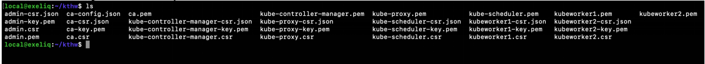

Now that the generation of client certificates is done, distribute the TLS certificate files to the control nodes and worker nodes. 
Distribute the cert files  along with kubeconfig and kube-proxy files generated that are associated with that particular worker node. 

For example:

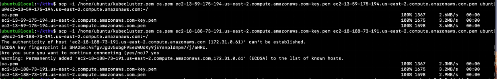
   
Similarly, distribute the following files to control nodes:

- ca.pem
- ca-key.pem 
- kubernetes-key.pem
- kubernetes.pem 
- service-account-key.pem 
- service-account.pem       
- admin.kubeconfig 
- kube-controller-manager.kubeconfig 
- kube-scheduler.kubeconfig
- encryption-config.yaml

You should be seeing all the distributed certs in the control plane nodes:

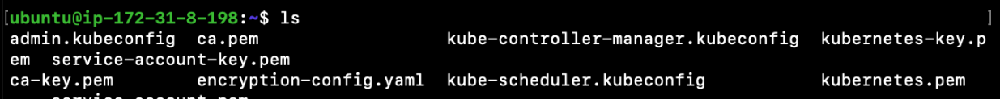

Kubernetes Control plane components: -
^^^^^^^^^^^^^^^^^^^^^^^^^^^^^^^^^^^^^^^

The control nodes setup is done by installing binaries related to Kubernetes components such as Kubernetes API Server. Kubernetes controller manager, Kubernetes scheduler and etcd cluster.

On Each controller node:
^^^^^^^^^^^^^^^^^^^^^^^^

Creating ETCD cluster:

.. code-block:: bash

   $ wget  "https://github.com/coreos/etcd/releases/download/v3.3.5/etcd-v3.3.5-linux-amd64.tar.gz"
   $ tar -xvf etcd-v3.3.5-linux-amd64.tar.gz
   $ sudo mv etcd-v3.3.5-linux-amd64/etcd* /usr/local/bin/
   $ sudo mkdir -p /etc/etcd /var/lib/etcd
   $ sudo cp ca.pem kubernetes-key.pem kubernetes.pem /etc/etcd/

1. create a shell variable that holds the node’s hostname

.. code-block:: bash

   ETCD_NAME = ec2-52-14-118-235.us-east-2.compute.amazonaws.com

2. Get the public ip of the host:

.. code-block:: bash

   INTERNAL_IP=$(curl http://169.254.169.254/latest/meta-data/local-ipv4)

3.Set the status of the initial cluster like:

.. code-block:: bash

   INITIAL_CLUSTER=<Cnode1 hostname>=https://<Cnode1 private ip>:2380,<Cnode2 hostname>=https://<Cnode2 private ip>:2380 

4. Create etcd Service file on both Cnodes  as shown:

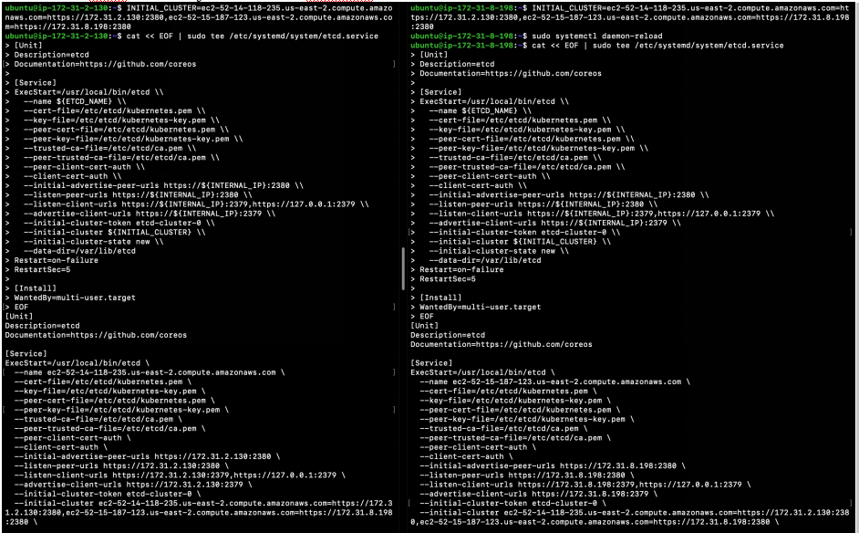

Load and restart System and etcd daemons:

.. code-block:: bash

   $ sudo systemctl daemon-reload
   $ sudo systemctl enable etcd
   $ sudo systemctl start etcd

Check the status of etcd service:

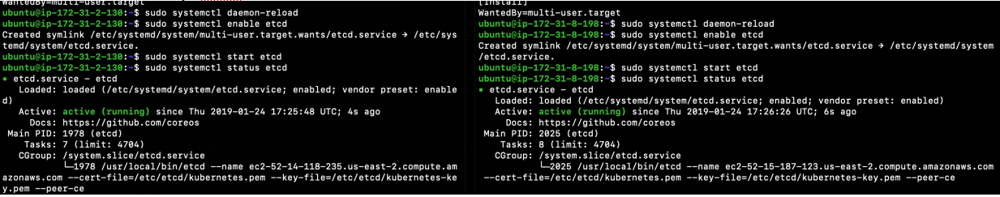

Retrieve Etcd details using certs.

.. code-block:: bash

   $ sudo ETCDCTL_API=3 etcdctl  member list --endpoints=https://172.31.2.130:2379,https://172.31.8.198:2379 --cacert=ca.pem  --cert=kubernetes.pem  --key=kubernetes-key.pem

You should be getting the etcd cluster members registered as shown:

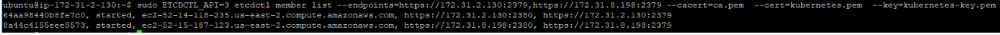
   
5. Installing Kubernetes components Binaries:

.. code-block:: bash

   sudo mkdir -p /etc/kubernetes/config

   wget -q --show-progress --https-only --timestamping \
      "https://storage.googleapis.com/kubernetes-release/release/v1.10.2/bin/linux/amd64/kube-apiserver" \
      "https://storage.googleapis.com/kubernetes-release/release/v1.10.2/bin/linux/amd64/kube-controller-manager" \
      "https://storage.googleapis.com/kubernetes-release/release/v1.10.2/bin/linux/amd64/kube-scheduler" \
      "https://storage.googleapis.com/kubernetes-release/release/v1.10.2/bin/linux/amd64/kubectl"

   chmod +x kube-apiserver kube-controller-manager kube-scheduler kubectl

   sudo mv kube-apiserver kube-controller-manager kube-scheduler kubectl /usr/local/bin/

6 .KUBEAPI SERVER:

.. code-block:: bash

   sudo mkdir -p /var/lib/kubernetes/

   sudo cp ca.pem ca-key.pem kubernetes-key.pem kubernetes.pem \
      service-account-key.pem service-account.pem \
      encryption-config.yaml /var/lib/kubernetes/

Create few environment variables that are used to create kubeAPI server config file.

.. code-block:: bash

   INTERNAL_IP=$(curl http://169.254.169.254/latest/meta-data/local-ipv4)
   CONTROLLER0_IP=<private ip of controller 0>
   CONTROLLER1_IP=<private ip of controller 1>

Generate the kube-apiserver unit file for systemd:

.. code-block:: bash

   cat << EOF | sudo tee /etc/systemd/system/kube-apiserver.service
   [Unit]
   Description=Kubernetes API Server
   Documentation=https://github.com/kubernetes/kubernetes

   [Service]
   ExecStart=/usr/local/bin/kube-apiserver \\
      --advertise-address=${INTERNAL_IP} \\
      --allow-privileged=true \\
      --apiserver-count=3 \\
      --audit-log-maxage=30 \\
      --audit-log-maxbackup=3 \\
      --audit-log-maxsize=100 \\
      --audit-log-path=/var/log/audit.log \\
      --authorization-mode=Node,RBAC \\
      --bind-address=0.0.0.0 \\
      --client-ca-file=/var/lib/kubernetes/ca.pem \\
      --enable-admission-plugins=Initializers,NamespaceLifecycle,NodeRestriction,LimitRanger,ServiceAccount,DefaultStorageClass,ResourceQuota \\
      --enable-swagger-ui=true \\
      --etcd-cafile=/var/lib/kubernetes/ca.pem \\
      --etcd-certfile=/var/lib/kubernetes/kubernetes.pem \\
      --etcd-keyfile=/var/lib/kubernetes/kubernetes-key.pem \\
      --etcd-servers=https://$CONTROLLER0_IP:2379,https://$CONTROLLER1_IP:2379 \\
      --event-ttl=1h \\
      --experimental-encryption-provider-config=/var/lib/kubernetes/encryption-config.yaml \\
      --kubelet-certificate-authority=/var/lib/kubernetes/ca.pem \\
      --kubelet-client-certificate=/var/lib/kubernetes/kubernetes.pem \\
      --kubelet-client-key=/var/lib/kubernetes/kubernetes-key.pem \\
      --kubelet-https=true \\
      --runtime-config=api/all \\
      --service-account-key-file=/var/lib/kubernetes/service-account.pem \\
      --service-cluster-ip-range=10.32.0.0/24 \\
      --service-node-port-range=30000-32767 \\
      --tls-cert-file=/var/lib/kubernetes/kubernetes.pem \\
      --tls-private-key-file=/var/lib/kubernetes/kubernetes-key.pem \\
      --v=2 \\
      --kubelet-preferred-address-types=InternalIP,InternalDNS,Hostname,ExternalIP,ExternalDNS
    Restart=on-failure
    RestartSec=5

    [Install]
    WantedBy=multi-user.target
    EOF

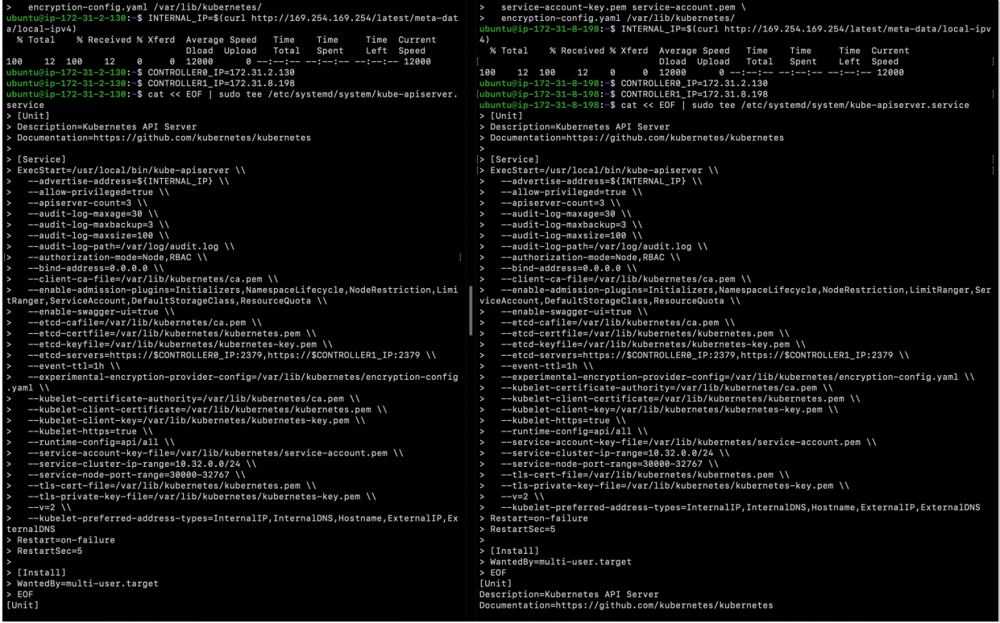

7. Kubernetes Controller Manager.

Similarly, Create kubeconfig and systemd unit file set up and ready to run the kube-controller-manager service on the control nodes. 

.. code-block:: bash

   $sudo cp kube-controller-manager.kubeconfig /var/lib/kubernetes/

Generate the kube-controller-manager systemd unit file:

.. code-block:: bash

   cat << EOF | sudo tee /etc/systemd/system/kube-controller-manager.service
   [Unit]
   Description=Kubernetes Controller Manager
   Documentation=https://github.com/kubernetes/kubernetes

   [Service]
   ExecStart=/usr/local/bin/kube-controller-manager \\
      --address=0.0.0.0 \\
      --cluster-cidr=10.200.0.0/16 \\
      --cluster-name=kubernetes \\
      --cluster-signing-cert-file=/var/lib/kubernetes/ca.pem \\
      --cluster-signing-key-file=/var/lib/kubernetes/ca-key.pem \\
      --kubeconfig=/var/lib/kubernetes/kube-controller-manager.kubeconfig \\
      --leader-elect=true \\
      --root-ca-file=/var/lib/kubernetes/ca.pem \\
      --service-account-private-key-file=/var/lib/kubernetes/service-account-key.pem \\
      --service-cluster-ip-range=10.32.0.0/24 \\
      --use-service-account-credentials=true \\
      --v=2
   Restart=on-failure
   RestartSec=5

   [Install]
   WantedBy=multi-user.target
   EOF

8. KubeScheduler:

Copy kube-scheduler.kubeconfig into the proper location:

.. code-block:: bash

   $sudo cp kube-scheduler.kubeconfig /var/lib/kubernetes/

Generate the kube-scheduler yaml config file.

.. code-block:: bash

   cat << EOF | sudo tee /etc/kubernetes/config/kube-scheduler.yaml
   apiVersion: componentconfig/v1alpha1
      kind: KubeSchedulerConfiguration
   clientConnection:
      kubeconfig: "/var/lib/kubernetes/kube-scheduler.kubeconfig"
   leaderElection:
     leaderElect: true
   EOF
   
Create the kube-scheduler systemd unit file:

.. code-block:: bash

   cat << EOF | sudo tee /etc/systemd/system/kube-scheduler.service
   [Unit]
   Description=Kubernetes Scheduler
   Documentation=https://github.com/kubernetes/kubernetes

   [Service]
   ExecStart=/usr/local/bin/kube-scheduler \\
      --config=/etc/kubernetes/config/kube-scheduler.yaml \\
      --v=2
   Restart=on-failure
   RestartSec=5

   [Install]
   WantedBy=multi-user.target
   EOF
   
Start and enable all of the services:

.. code-block:: bash

   $ sudo systemctl daemon-reload
   $ sudo systemctl enable kube-apiserver kube-controller-manager kube-scheduler
   $ sudo systemctl start kube-apiserver kube-controller-manager kube-scheduler

Check the status of the Kubernetes components. All of them should be in running  state:

.. code-block:: bash

   $ sudo systemctl status kube-apiserver kube-controller-manager kube-scheduler

The following image shows status of the kubernetes components on both the control nodes:

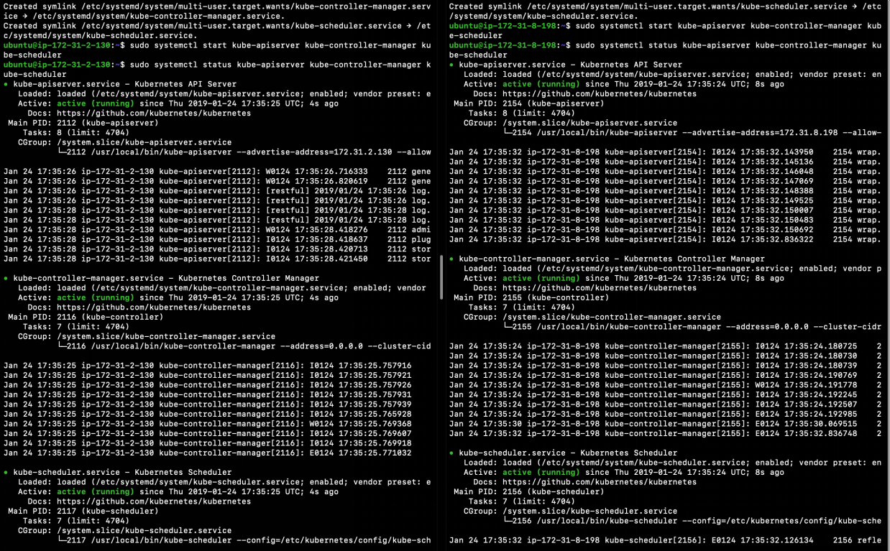

9. Now Use kubectl on one of your control node to check component statuses:

.. code-block:: bash

   $ kubectl get componentstatuses --kubeconfig admin.kubeconfig

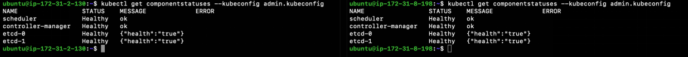
You see the kube components as healthy and ok.

10. RBAC - to assign permissions that allow the Kubernetes API to access various functionality within the worker kubelets.

Create a role with the necessary permissions:

.. code-block:: bash

   cat << EOF | kubectl apply --kubeconfig admin.kubeconfig -f -
   apiVersion: rbac.authorization.k8s.io/v1beta1
   kind: ClusterRole
   metadata:
      annotations:
         rbac.authorization.kubernetes.io/autoupdate: "true"
      labels:
         kubernetes.io/bootstrapping: rbac-defaults
      name: system:kube-apiserver-to-kubelet
      rules:
        - apiGroups:
            - ""
      resources:
        - nodes/proxy
        - nodes/stats
        - nodes/log
        - nodes/spec
        - nodes/metrics
      verbs:
        - "*"
   EOF
   
Bind the role to the kubernetes user:

.. code-block:: bash

   cat << EOF | kubectl apply --kubeconfig admin.kubeconfig -f -
   apiVersion: rbac.authorization.k8s.io/v1beta1
   kind: ClusterRoleBinding
   metadata:
      name: system:kube-apiserver
      namespace: ""
   roleRef:
      apiGroup: rbac.authorization.k8s.io
      kind: ClusterRole
      name: system:kube-apiserver-to-kubelet
   subjects:
     - apiGroup: rbac.authorization.k8s.io
       kind: User
       name: kubernetes
   EOF

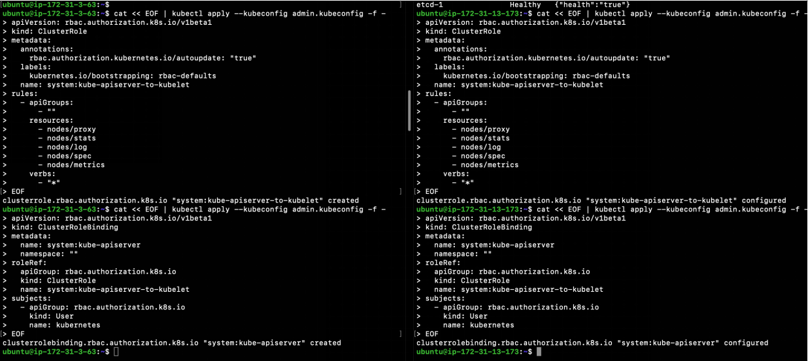
   
On the Load Balancer:

.. code-block:: bash

   $ sudo apt-get install -y nginx
   $ sudo systemctl enable nginx
   $ sudo mkdir -p /etc/nginx/tcpconf.d
   $ sudo vi /etc/nginx/nginx.conf

Add the following to the end of nginx.conf:

.. code-block:: bash

   include /etc/nginx/tcpconf.d/*;

Set the private IP’s of the control nodes to environment variables:

.. code-block:: bash

   $ CONTROLLER1_IP=<Cnode1 private ip>
   $ CONTROLLER2_IP=<Cnode2 private ip>

Create the load balancer nginx config file:

.. code-block:: bash

   cat << EOF | sudo tee /etc/nginx/tcpconf.d/kubernetes.conf
      stream {
      upstream kubernetes {
         server $CONTROLLER1_IP:6443;
         server $CONTROLLER2_IP:6443;
       }
      server {
         listen 6443;
         listen 443;
         proxy_pass kubernetes;
       }
     }
    EOF

Reload the nginx configuration:

.. code-block:: bash

   $ sudo nginx -s reload

You can verify that the load balancer is working like so:

.. code-block:: bash

   $ curl -k https://lbpublicip:6443/version

You should get the version of the Kubernetes Installed. As below:

.. code-block:: bash

   {
     "major": "1",
     "minor": "10",
     "gitVersion": "v1.10.2",
     "gitCommit": "81753b10df112992bf51bbc2c2f85208aad78335",
     "gitTreeState": "clean",
     "buildDate": "2018-04-27T09:10:24Z",
     "goVersion": "go1.9.3",
     "compiler": "gc",
     "platform": "linux/amd64"
    }

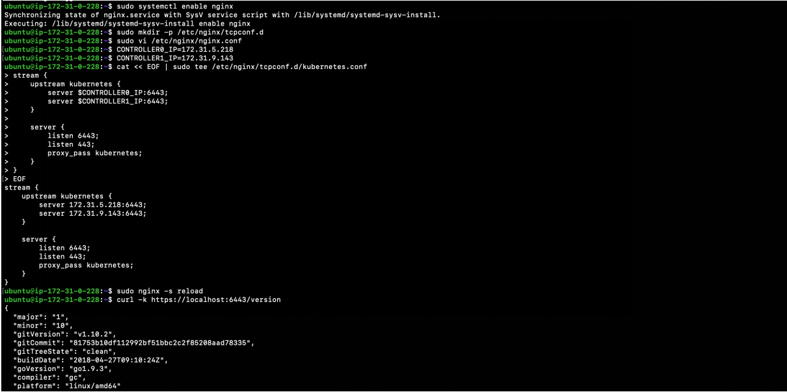
   
Now that the Control plane nodes along with the Load Balancer are set up. 

- Kubernetes Worker Nodes –

The following components needs to be installed in Kubernetes Worker Nodes.

1. Docker(container runtime) – downloads images and runs containers.

   Install docker in Client mode:

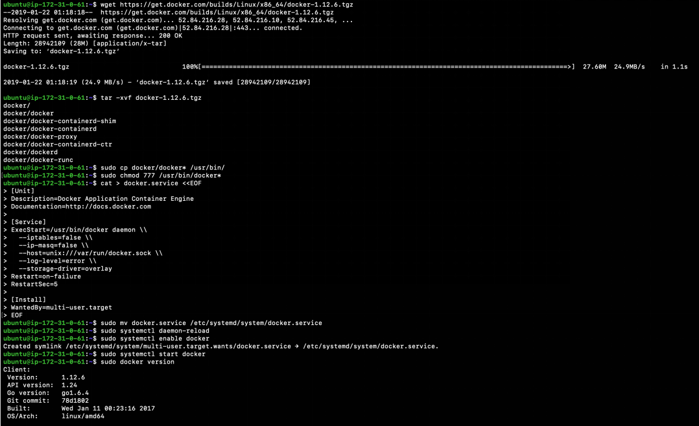

2.Kubelet  - controls each worker node, provide the APIs that are used by the control plane to manage nodes and pods and interacts with container runtime to manage containers.

Assgin the hostname to an environment Variable. And create kubelet config file.

.. code-block:: bash

   $ HOSTNAME=$(hostname)
   $ sudo mv ${HOSTNAME}-key.pem ${HOSTNAME}.pem /var/lib/kubelet/
   $ sudo mv ${HOSTNAME}.kubeconfig /var/lib/kubelet/kubeconfig
   $ sudo mv ca.pem /var/lib/kubernetes/

Create the kubelet config file:

.. code-block:: bash

   cat << EOF | sudo tee /var/lib/kubelet/kubelet-config.yaml
   kind: KubeletConfiguration
   apiVersion: kubelet.config.k8s.io/v1beta1
   authentication:
     anonymous:
        enabled: false
     webhook:
        enabled: true
     x509:
        clientCAFile: "/var/lib/kubernetes/ca.pem"
   authorization:
     mode: Webhook
   clusterDomain: "cluster.local"
   clusterDNS: 
       - "10.32.0.10"
   runtimeRequestTimeout: "15m"
   tlsCertFile: "/var/lib/kubelet/${HOSTNAME}.pem"
   tlsPrivateKeyFile: "/var/lib/kubelet/${HOSTNAME}-key.pem"
   EOF

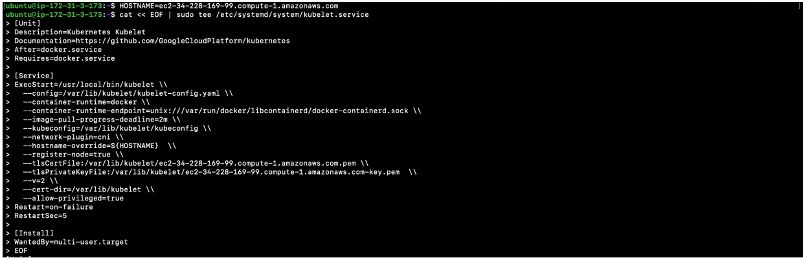
   
Similarly, Create the kubelet unit file:

.. code-block:: bash

   cat << EOF | sudo tee /etc/systemd/system/kubelet.service
   [Unit]
   Description=Kubernetes Kubelet
   Documentation=https://github.com/kubernetes/kubernetes
   After=containerd.service
   Requires=containerd.service

   [Service]
   ExecStart=/usr/local/bin/kubelet \\
      --config=/var/lib/kubelet/kubelet-config.yaml \\
      --container-runtime=remote \\
      --container-runtime-endpoint=unix:///var/run/containerd/containerd.sock \\
      --image-pull-progress-deadline=2m \\
      --kubeconfig=/var/lib/kubelet/kubeconfig \\
      --network-plugin=cni \\
      --register-node=true \\
      --v=2 \\
      --hostname-override=${HOSTNAME} \\
      --allow-privileged=true
   Restart=on-failure
   RestartSec=5

   [Install]
   WantedBy=multi-user.target
   EOF

Check the kubelet status :

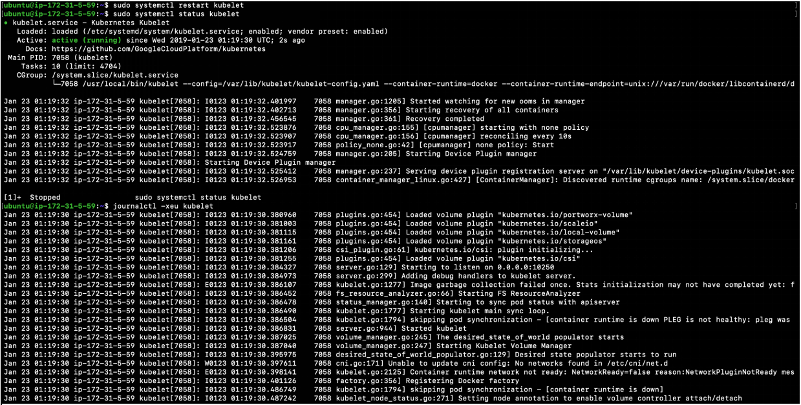

3.Kube-proxy – manages iptables rules on the node to provide virtual network access to pods.

You can configure the kube-proxy service like:

Create the kube-proxy config file:

.. code-block:: bash

   cat << EOF | sudo tee /var/lib/kube-proxy/kube-proxy-config.yaml
   kind: KubeProxyConfiguration
   apiVersion: kubeproxy.config.k8s.io/v1alpha1
   clientConnection:
      kubeconfig: "/var/lib/kube-proxy/kubeconfig"
      mode: "iptables"
   clusterCIDR: "10.200.0.0/16"
   EOF
   
Create the kube-proxy unit file:

.. code-block:: bash

   cat << EOF | sudo tee /etc/systemd/system/kube-proxy.service
   [Unit]
   Description=Kubernetes Kube Proxy
   Documentation=https://github.com/kubernetes/kubernetes

   [Service]
   ExecStart=/usr/local/bin/kube-proxy \\
     --config=/var/lib/kube-proxy/kube-proxy-config.yaml
   Restart=on-failure
   RestartSec=5

   [Install]
   WantedBy=multi-user.target
   EOF
   
Now you are ready to start up the worker node services! Run these:

.. code-block:: bash

   $ sudo systemctl daemon-reload
   $ sudo systemctl enable docker kubelet kube-proxy
   $ sudo systemctl start docker kubelet kube-proxy

Finally, verify that both workers have registered themselves with the cluster. Log in to one of your control nodes and run:

.. code-block:: bash

   $ kubectl get nodes

You should be seeing nodes registered as worker nodes,but are not ready for scheduling as CNI plugin is not yet installed.

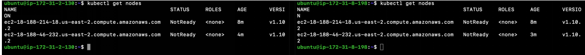
We have showcased calico in kubeadm similarly install weavenet in here:

Weavenet –

.. code-block:: bash

   $ kubectl apply -f https://cloud.weave.works/k8s/net?k8s-version=$(kubectl version | base64 | tr -d '\n')

Once weavenet/Calico or any CNI plugin is installed, you will see nodes are ready for the pods to be scheduled:
 
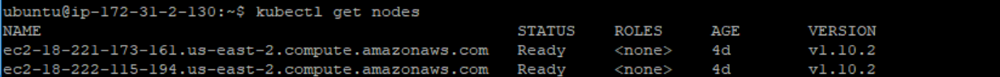

Once the Nodes are in ready state, kubernets can start scheduling pods.

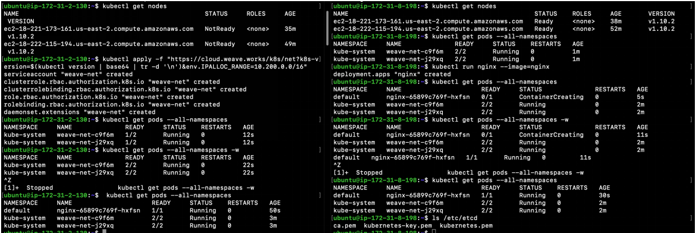
   
To delete/uninstall Weavenet CNI plugin:

.. code-block:: bash

   $ kubectl delete -f "https://cloud.weave.works/k8s/net?k8s-version=$(kubectl version | base64 | tr -d '\n')"

To configure Kubectl to work remotely said in another way, you can operate/interact with kubernetes cluster remotely by configuring Kubectl:

.. code-block:: bash

   Kubectl config set-cluster   - config for location of the cluster
   Kubectl config set-credentials – to set the username and client certificate
   Kubectl config set-context default
   Kubectl-config use-context default – to set current context to the config we provided.

.. code-block:: bash

   kubectl config set-cluster kubernetes-the-hard-way \
      --certificate-authority=ca.pem \
      --embed-certs=true \
      --server=https://LBPUBLIC:6443

   kubectl config set-credentials admin \
      --client-certificate=admin.pem \
      --client-key=admin-key.pem

   kubectl config set-context kubernetes-the-hard-way \
      --cluster=kubernetes-the-hard-way \
      --user=admin

   kubectl config use-context kubernetes-the-hard-way

To mark a node unschedulable, run this command:

.. code-block:: bash

   $ kubectl cordon $NODENAME

Smoke testing the Cluster:

Create an application Yaml for our flask application to be deployed in the cluster:

.. code-block:: YAML

   #Flaskapp.yaml
   apiVersion: apps/v1beta1
   kind: Deployment
   metadata:
     name: flask
   spec:
     replicas: 1
     template:
        metadata:
            labels:
                app: flask
            spec:
               containers:
                  - name: flask
                    image: exeliq/flask_py
               ports:
                  - containerPort : 5000

Apply the Flask Application Yaml with kubectl:

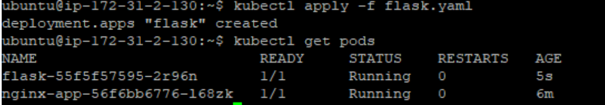

Now describing the pod would let us know on which node the pod is scheduled and when the deployment is exposed as of type NodePort, it can be accessed from the public ip of the node along with the port assigned to the service by kubernetes cluster. The following image shows the Pod has been scheduled to run on one of the instance:

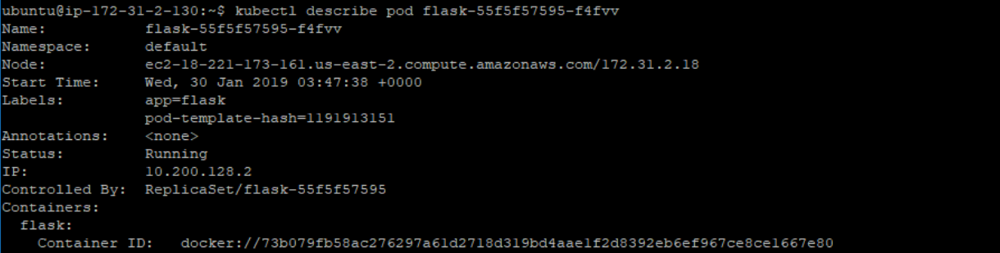

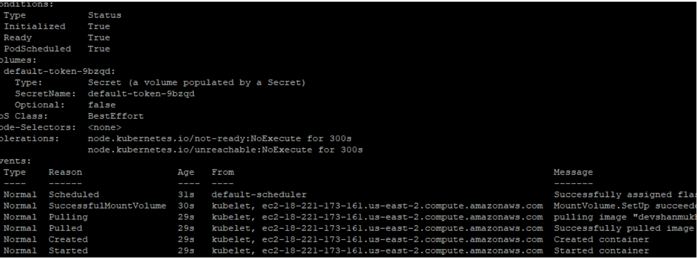

Accessing the serv ice using node ip and port:

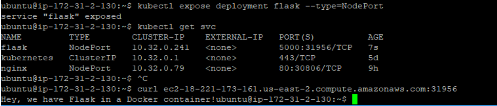

