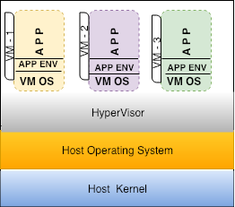
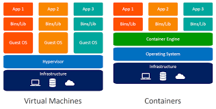

###############
Virtualization
###############

1. Introduction to Virtualization
----------------------------------

Virtualization – “In computing, Virtualization refers to the act of creating a virtual(rather than actual) version of something, including
virtual computer platforms, storage devices and computer network resources.” – Wikipedia

   
Virtualization for example allows you to create environments  that let’s you deploy your application in an encapsulated environment  so called virtual machine, that consists of all the resources that required by application to run along with Operating system that is completely abstracted from that of the physical server’s and further you can create many of these Virtual machines and deploy your applications.

1.1 Need for Virtualization 
""""""""""""""""""""""""""""

- Improves availability - makes the application available within minutes to hours with existing Data Center resources
- Automatic load balancing
- Virtualization lowers costs and improves efficiency of the physical hardware.
- Data protection
- Disaster recovery
- Reduces energy consumption and maintenance
- Increase Business Agility

1.2 Forms of Virtualization
"""""""""""""""""""""""""""

- Server Virtualization leverages storage virtualization and Network virtualization
- Storage virtualization
- Network virtualization(NW function virtualization)
- Desktop virtualization
- I/O virtualization – multiple fibre channel connections with single cable 
- Application virtualization -  multiple version of application

1.3 Hypervisor 
"""""""""""""""

“A hypervisor or Virtual Machine monitor is computer software, firmware or hardware that creates and runs virtual machines” – Wikipedia 
Simply said, hypervisor is a piece of software that makes server virtualization possible, that is responsible for creating and running virtual machines on top of the virtualization layer. It is responsible for providing the resources required by the virtual machine . These resources are such as Virtual CPU, virtual memory, virtual Disk and virtual Network etc.

Hypervisors have optimization techniques for if you overcommit the resources(of course you can) such as cpu and memory to virtual machines than you have on physical resources.

1.4 Virtual machine
"""""""""""""""""""""

A virtual machine is an encapsulated environment with operating systems that are running on top of  virtualization layer and inside VM we have a guest operating system isolated form underlying physical server. In other words, the implementation of a VM is virtualizing an hardware layer with a hypervisor where the resources are isolated from physical hardware.The VMs treat themselves as a whole server without knowing that its sharing resources such as virtual cpu, memory, networking and storage with another VM. These are resources are provisioned through virtualization layer. These VMs are portable and are hardware independent.

1.5 What exactly is server virtualization?
"""""""""""""""""""""""""""""""""""""""""""

Running an operating system and application in an encapsulated virtual machine on top of virtualization layer. This operating system is abstracted from the physical servers. These encapsulated VM’s are virtualized servers.

1.6 Complexities of Virtualization
"""""""""""""""""""""""""""""""""""

- Greater demands on all resources(performance bottlenecks)
- Blending of storage IO – Blender effect
- Complexity in troubleshooting – performance issues – you have to install full operating system to launch an application.

2. Introduction to containers   
-------------------------------

Containers, or otherwise known as operating-system-level virtualization, are a lightweight approach to virtualization that only provides the bare minimum that an application requires to run and function as intended. In a way, they can be considered as super minimalist virtual machines that are not running on a hypervisor. Items usually bundled into a container include:

- Application
- Dependencies
- Libraries
- Binaries
- Configuration files

Containerizing an application enables it to run reliably in different environments by abstracting away the operating system and the physical infrastructure. Containerized applications are sharing the kernel of the host operating system with other containers and the shared part of the OS is read only. Inside a container, there is often a single executable service or microservice.

The size of the containers is usually measured in tens of megabytes and it only takes 1–2 seconds to provision one. When the load is increasing new containers can be created and when the load drops containers can be destroyed. When containers need to be updated you only need to modify the configuration file and then create new containers and destroy the old ones.

2.1 Virtual machines Vs Containers
""""""""""""""""""""""""""""""""""""

Both VMs and containers can be used to isolate applications from other applications running on the same host. VMs have an added degree of isolation from the hypervisor, where as containers are seemed to be itself as a process at the host OS point of view. The container engine is responsible for starting and stopping containers in a similar way to the hypervisor on a VM.
Containers are created through Linux kernel features esp. **namespaces** and **cgroups**. 

3. Virtualizion vs Containerized Architecture
----------------------------------------------

4. Centralized containerization vs Distributed containerization
--------------------------------------------------------------------

Application/Centralized containerization is an OS-level virtualization method used to deploy and run distributed applications without launching an entire virtual machine (VM) for each app. Multiple isolated applications or services run on a single host and access the same OS kernel. 

And opposite to this in Distributed containerization the applications from different containers communicating to each other.

